## 网络和Internet

### 网络设置

EdgeLink支持两种网络方式以实现RTU与其他设备通讯，即有线以太网传输方式及无线传输方式。在EdgeLink Studio中可以对这两种方式进行配置。此外还包括OpenVPN、L2TP/Ipsec、PPPOE、桥接等多种网络环境的设置。

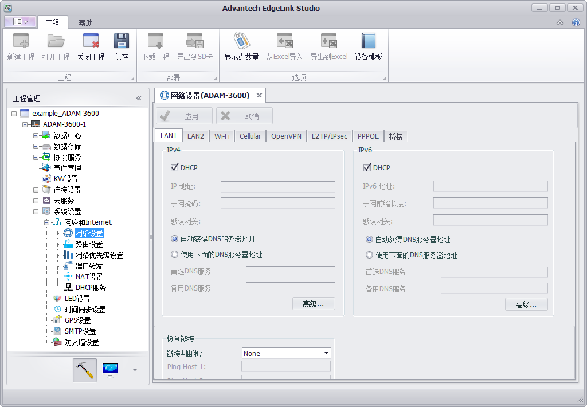

----

#### 有线网络设定

EdgeLink 有2路以太网口，可选择网口分别配置，在以太网络下支持IPv4和IPv6两种网络模式设定，在这两种模式下，用户均可将RTU设定为DHCP方式或固定IP方式。

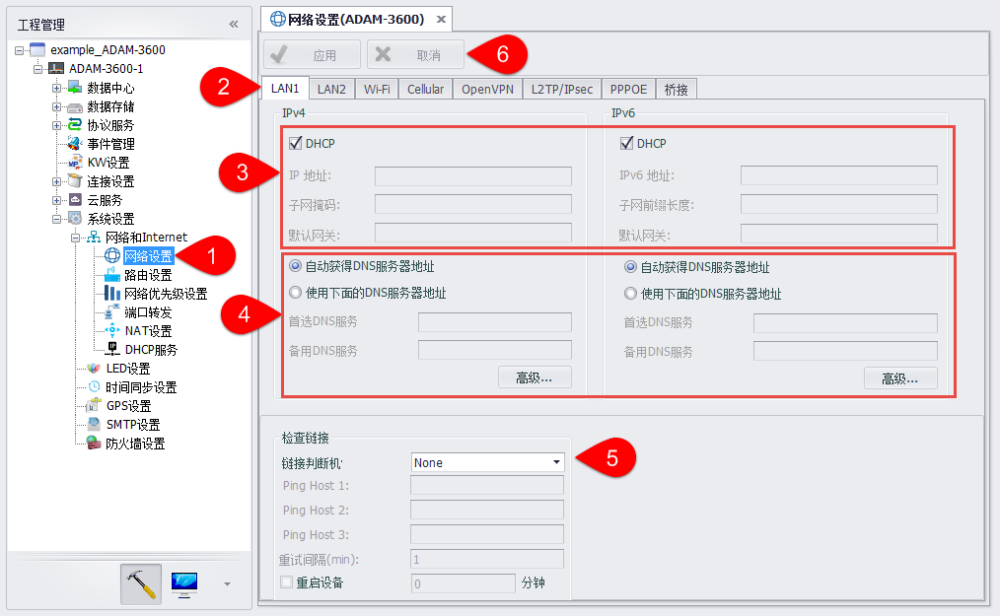

1. 打开“系统设置”-“网络和Internet”-“网络设置”页面。

2. 选择设置某个有线网络信息。

3. 勾选DHCP或者不勾选，写入固定IP信息。

4. DNS设置。当选择“使用下面的DNS服务器地址”时，除了输入“首选DNS服务器”和“备用DNS服务器”外，可以点击“高级”按钮，在新窗口中维护更多DNS信息，包括添加、删除、修改、排序，排在前面的DNS服务器将优先使用。

    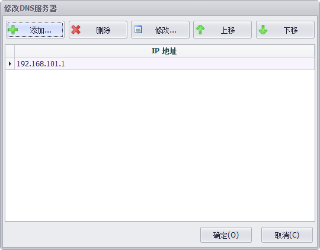

5. 设置网络检查链接信息。可使用Ping IP/URL模式进行网络检查，需要用户至少输入一个ping的目标地址。RTU会每隔一段时间ping这些目标地址。如果需要在判断链接断开后重启RTU，可以勾选“重启设备”，RTU将在链接断开一段时间后重启。

    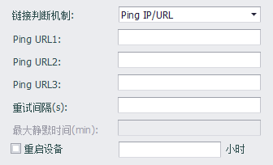

6. 点击应用，完成配置。

----

#### 无线wifi网络设定

Wifi网络支持两种模式：客户端模式和AP模式，在Wifi网络设置界面可以分别设置。

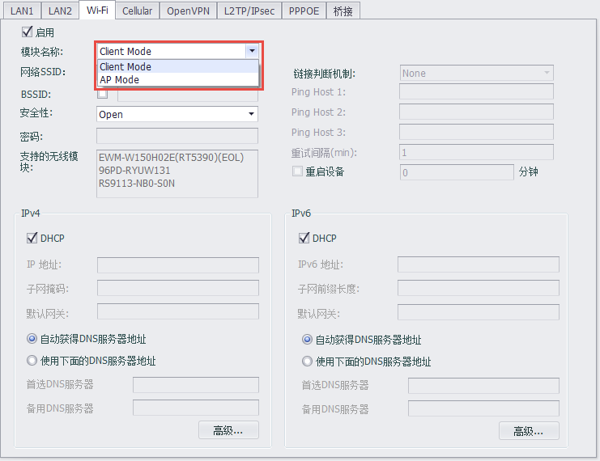

##### 客户端模式

与以太网口类似，Wifi网络客户端模式下也支持IPv4和IPv6两种网络模式设定，在这两种模式下，用户均可将RTU设定为DHCP方式或固定IP方式。

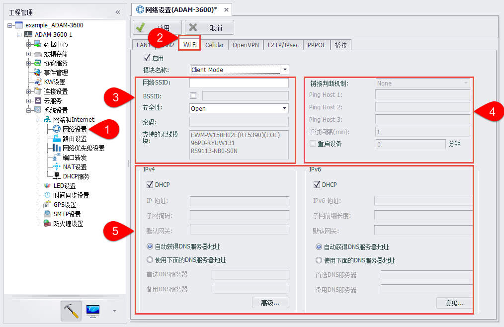

1. 打开“系统设置”-“网络和Internet”-“网络设置”页面。

2. 选择设置Wifi网络信息。

3. 用户需要设置无线局域网SSID名称和安全性才能加入该网络，网络的安全性模式有3种可选

    (1) Open：局域网是开放的，不需输入密码，即可进入该局域网；　

    (2) WEP：一种认证类型，加密局域网，需要输入密码；　

    (3) WPA/WPA2 PSK：一种认证类型，进阶加密局域网，需要输入密码。

    若需要设置通过“MAC”地址绑定使用WIFI功能，则需在页面中选中“BSSID”复选框，并在其后的文本框中输入AP的MAC地址。

    此外，页面中列出了系统支持的无线模块信息。

4. 设置网络检查链接信息。与以太网口类似，可使用Ping IP/URL模式进行网络检查，需要用户至少输入一个ping的目标地址。RTU会每隔一段时间ping这些目标地址。如果需要在判断链接断开后重启RTU，可以勾选“重启设备”，RTU将在链接断开一段时间后重启。

    

5. 与以太网口类似，用户需勾选DHCP或者不勾选，写入固定IP信息，并设置Wifi网络的DNS信息。

点击应用，完成配置。

##### AP模式

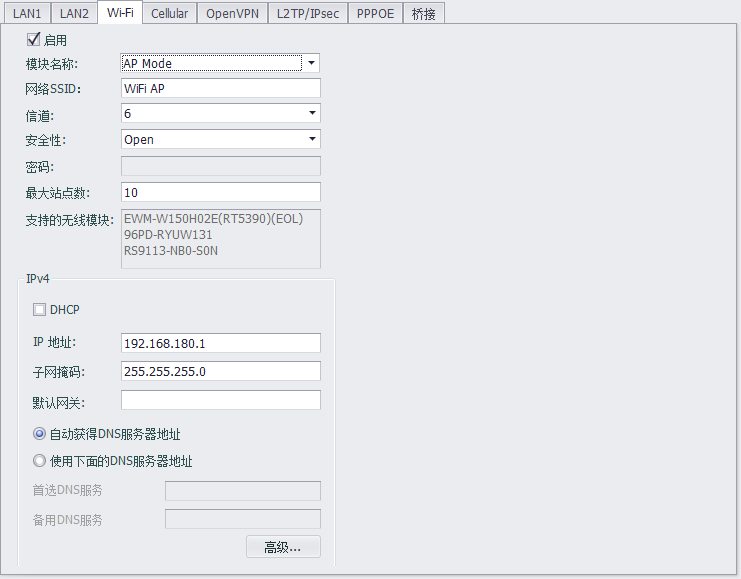

在wifi ap模式下，用户需要填写网络SSID、信道、安全性、密码、最大站点数、支持的无线模块、IPv4信息。

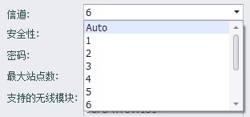

----

#### Cellular网络设定

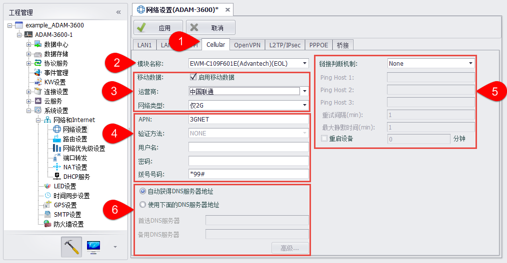

1. 打开“系统设置”-“网络和Internet”-“网络设置”页面，选择设置Cellular网络信息。

2. 选择使用的无线数据终端类型，即模块名称。在工程编译时会根据不同的终端类型生成不同的脚本。

    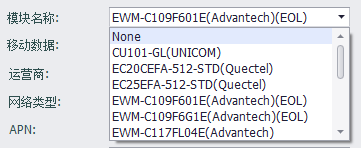

3. 勾选“启动移动数据”选择框即可启动RTU的GPRS功能。用户可以选择无线终端支持的运营商，并可选择连接2G、3G、4G移动网络或无线专网。

    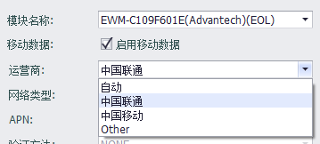

    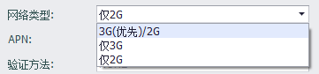

4. 在无线终端支持的运营商中，若用户选择“自动”，则不需要用户输入APN、连接用户名、密码、号码等信息；否则需要输入APN、连接用户名、密码、号码等信息。在工程编译时会依据默认设置为每个运营商生成一套脚本。EdgeLink 会依据插入的sim卡类型选择相应的脚本连接网络。

5. RTU提供两种连接判断机制，Ping IP/URL模式与监控数据通信模式。

    (1) Ping IP/URL模式中需要用户至少输入一个ping的目标地址。RTU会每隔一段时间ping这些目标地址。如果需要在判断链接断开后重启RTU，可以勾选“重启设备”，RTU将在链接断开一段时间后重启。

    

    (2) 监控数据通信模式中RTU会监控数据传输，如果没有数据传输的时间超过最大静默时间，RTU会判断链接已断开。如果需要在判断链接断开后重启RTU，可以勾选“重启设备”，RTU将在链接断开一段时间后重启。

    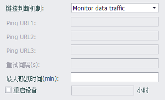

    **设置最大静默时间时需要注意，最大静默时间不宜太大，否则会影响SIM卡切换的时间。同时启用重启设备时，建议最大静默时间小于重启设备时间的二分之一**

6. 设置GPRS网络的DNS信息。

点击应用，完成配置。

----

##### 双网卡配置

在ADAM-3600-D1GL1等具有双网卡功能的设备上，除了以上这些基本设置外，还需要配置双网卡切换方式等设置。

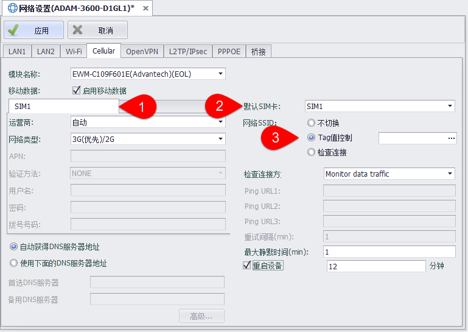

1. 两个网卡可以配置不同的运营商和连接信息。

2. 需要选择一个网卡作为默认网卡，设备启动时优先连接默认网卡。

3. 配置网卡的切换方式

    - 不切换：运行中不进行网卡切换
    
    - Tag值控制：利用Tag点值控制网卡切换，值为1时切换为网卡1，值为2时切换为网卡2，其余值不切换。
    
    - 检查连接：依照连接判断机制进行网卡切换，当判断网络连接失败时进行网卡切换

----

#### OpenVPN设置

可以通过设置OpenVPN使EdgeLink作为客户端通过虚拟专用通道与VPN服务器相连。“系统设置”-“网络和Internet”-“网络设置”中的“OpenVPN”选项卡可以进行OpenVPN设置。

##### 基本设置

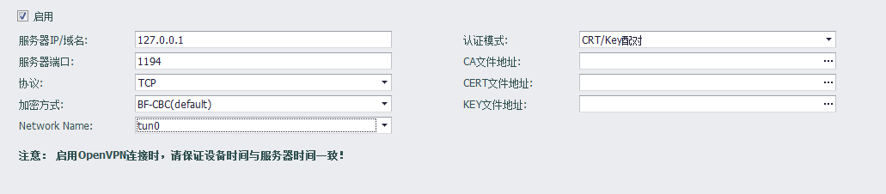

由于需要与VPN服务器相连，需要配置如下属性：

1. 服务器IP或域名
2. VPN连接使用的端口号，默认为1194
3. 使用的传输协议，可以选择TCP或UDP
4. 传输的加密方式，可以选择FB-CBC、AES-128-CBC、DES-EDE3-CBC三种加密方式

##### 认证模式-CRT/Key配对

EdgeLink支持两种认证模式，CRT/Key配对、用户名/密码。

CRT/Key配对需要用户将OpenVPN服务器上生成的CA文件、CERT文件、KEY文件放到EdgeLink Studio所在的电脑上。
在本页面载入后，这三个文件会在工程下载时被下载到EdgeLink中。

##### 认证模式-用户名/密码

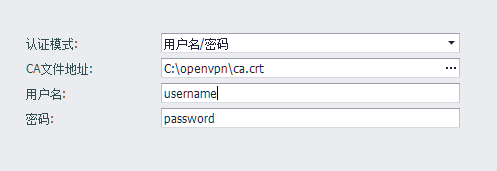

使用用户名、密码连接OpenVPN服务器时同样需要服务器上生成的CA文件。
同时还需要服务器上分配的用户名和密码。

##### TLS身份认证

1. 当连接的OpenVPN服务器需要进行TLS身份认证时，可以在认证文件栏中输入认证文件的路径，以启用TLS身份认证。

2. 认证方向的值应该与OpenVPN服务器是互补的, 例如服务器为"0"时客户端应该选择"1",或者两端都设置忽略此值。

----

#### L2TP/Ipsec设置

可以通过设置L2TP/IPsec VPN使EdgeLink作为客户端通过虚拟专用通道与L2TP/IPsec VPN服务器相连。打开“系统设置”-“网络和Internet”-“网络设置”中的“L2TP/IPsec”选项卡可以进行L2TP/IPsec VPN设置。

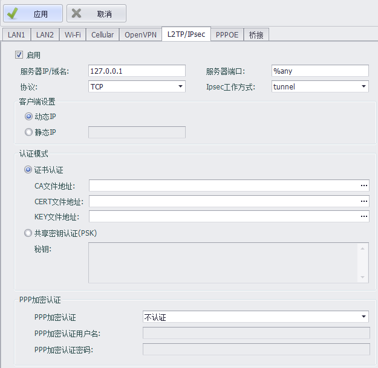

##### 基本设置

由于需要与VPN服务器相连，需要配置如下属性：

1. 服务器IP或域名
2. VPN连接使用的端口号，默认为%any
3. 使用的传输协议，可以选择TCP或UDP
4. Ipsec工作方式，可以选择tunnel、transport两种方式

##### 客户端设置

设置客户端获取IP地址的方式。动态IP为系统自动分配。静态IP为用户设置。

在设置静态IP时，应确保服务器端相应设置正确，否则无法连通。

##### 认证模式

EdgeLink支持两种认证模式，证书认证和共享秘钥认证（PSK）。

证书认证

用户需要将OpenVPN服务器上生成的CA文件、CERT文件、KEY文件放到EdgeLink Studio所在的电脑上。
在本页面载入后，这三个文件会在工程下载时被下载到EdgeLink中。

共享秘钥认证（PSK）

输入秘钥进行认证。

##### PPP加密认证

EdgeLink支持三种PPP加密认证模式，不加密、chap和pap方式。

选择chap认证和pap认证均需要输入认证用户名和密码，选择不认证不需输入。

----

#### PPPOE设置

通过PPPOE设置可将LAN口作为WAN口使用，进行拨号上网操作。打开“系统设置”-“网络和Internet”-“网络设置”中的“PPPOE”选项卡可以进行PPPOE设置。

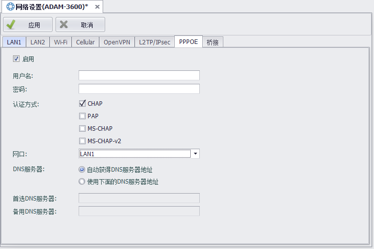

用户需要填写PPPOE用户名、密码，选择使用的认证方式（可多选）、选择设置的网口、设置DNS服务器信息，即可完成PPPOE设置。

----

#### 网络桥接设置

在EdgeLink 非UNO和WISE710的linux平台支持网卡桥接设置。打开“系统设置”-“网络和Internet”-“网络设置”中的“桥接”选项卡可以进行网卡桥接设置。

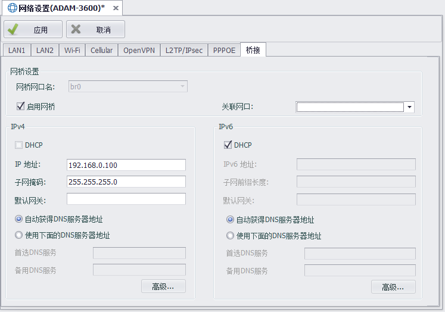

用户需要勾选是否启用网桥、设置网桥关联网口和IPv4、IPv6信息，即可完成网桥设置。

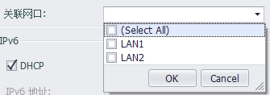