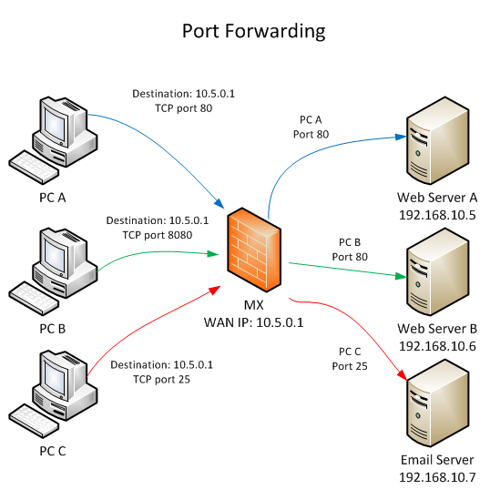
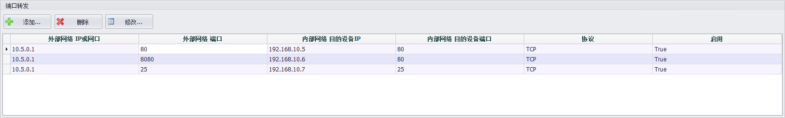
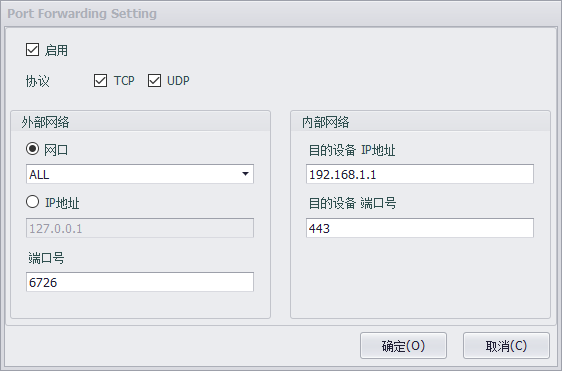

## 网关功能

使用设备作为网关时，一般使用一个网口连接外网，一个或多个网口连接内网。EdgeLink支持端口转发与NAT功能帮助用户更方便的管理网络。

### 端口转发

使用设备作为网关时，外网用户是无法直接访问内网的设备的。可以通过在路由器上设置端口转发，建立外网网口的端口与内网设备IP的映射。即网关会将发往网关外网网口某一特定端口的请求，通过内网网口转发到内网某一特定IP的设备上，内网设备就可以被外网访问了。

如上图设置，设备会将外网访问设备ip为10.5.0.1网口80端口的tcp请求，转发到内网ip为192.168.10.5设备的80端口上。

设备会将外网访问设备ip为10.5.0.1网口8080端口的tcp请求，转发到内网ip为192.168.10.6设备的80端口上。

设备会将外网访问设备ip为10.5.0.1网口25端口的tcp请求，转发到内网ip为192.168.10.7设备的25端口上。

Studio中配置如下

转换为iptables脚本为

	iptables -t nat -A PREROUTING -d 10.5.0.1 -p tcp --dport 80 -j DNAT --to 192.168.10.5:80
	iptables -t nat -A PREROUTING -d 10.5.0.1 -p tcp --dport 8080 -j DNAT --to 192.168.10.6:80
	iptables -t nat -A PREROUTING -d 10.5.0.1 -p tcp --dport 25 -j DNAT --to 192.168.10.7:25
	iptables -t nat -A POSTROUTING -j MASQUERADE

用户可配置的属性如下：

- 启用：选择启用时，将添加此条配置到forward.sh中。
- 协议：可以选择只支持TCP、UDP或两种协议都支持。
- 外部网络-网口：选择转发所有访问或者只对特定网口的请求进行转发。
- 外部网络-IP地址：选择只对特定IP的请求进行转发。
- 外部网络-端口号：设置进行转发的端口号，也就是外网请求的端口。
- 内部网络-目的设备 IP地址：设置要转发到的内网设备IP地址。
- 内部网络-目的设备 端口号：设置要转发到的内网设备端口号。
