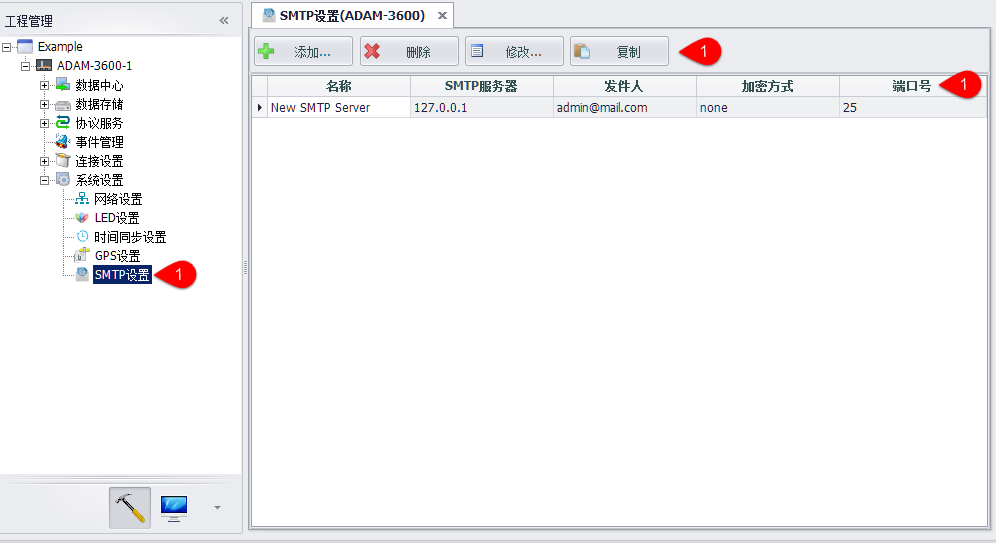
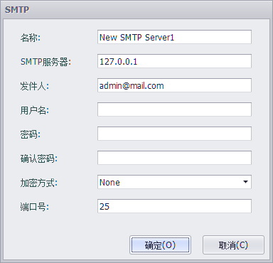

## SMTP设置

在事件管理中选择以邮件方式发送时间信息前，需要先设置SMTP。

1. 在设备->系统设置->SMTP设置节点双击可打开编辑界面。
2. 用户可以添加、删除、修改SMTP，还可以复制已有的SMTP设置
3. 已有的SMTP设置会显示在列表中，双击选中行也可打开编辑界面。

### SMTP编辑

1. SMTP的名称：只在EdgeLink Studio中会用到。
2. SMTP服务器：可输入IP或域名。
3. 发件人：收到邮件时显示的发件人邮箱地址。
4. 用户名：连接SMTP服务器时需要的用户名。
5. 密码：连接SMTP服务器时需要的密码。
6. 确认密码：需要再次输入同样的密码。
7. 加密方式：可以选择不加密或SSL、TLS两种加密方式。
8. 选择被加密时默认端口为25，选择SSL加密时默认端口为465，选择TLS加密时默认端口为587。