> VCOM 管理程序安装包下载链接：[https://www.advantech.tw/support/details/utility?id=1-24KJ5E7](https://www.advantech.tw/support/details/utility?id=1-24KJ5E7)

## VCOM 使用说明

### 1. 简介

VCOM 即虚拟串口（Virtual COM），通过网关提供的 VCOM 功能，使用者可以将远程的串口设备（例如网关下面接的PLC）映射到 PC 机（控制中心）的虚拟串口上，如下图所示，从而能够直接在 PC 机（控制中心）以串口通信的方式对该设备进行管理和维护。一般来说，被管理设备的配套串口通信软件，可以直接用于映射出的虚拟串口上。

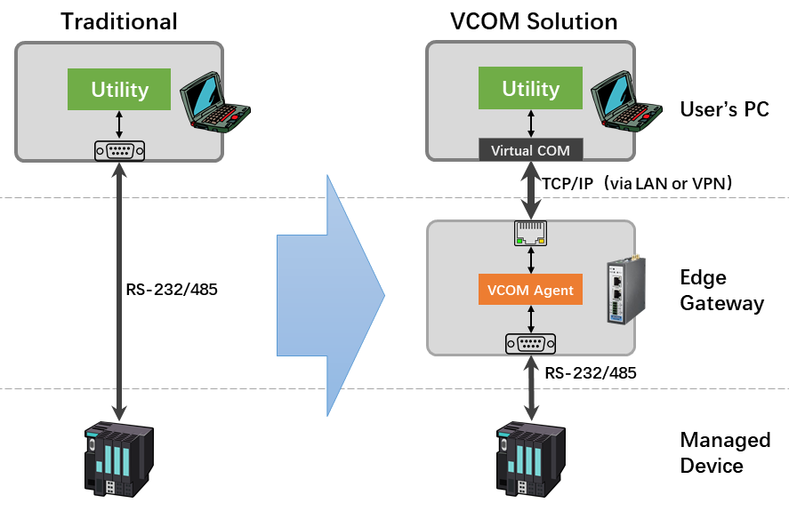

在使用 VCOM 时，请注意以下事项：

1. VCOM 功能是为了远程设备维护的用途设计的，适用于对通信延迟不敏感，操作时间不长的应用，比如参数配置，固件更新等，切勿将其作为串口服务器来使用。
2. 虚拟串口的延迟和稳定性取决于 TCP 连接的特性，如果 TCP 连接经由的是蜂窝无线网络或者其它高延迟的链路，请适当调整串口设备配套应用软件的通信超时参数。
3. 如果网关上的串口已经被配置为采集程序占用的端口，那么由于串口使用上的独占性，在 VCOM 绑定串口之后，采集程序会中断数据采集，直至该串口被解绑以后，采集程序才会恢复数据采集。

### 2. 通过 EdgeLinkStudio 启用网关上的 VCOM 功能

网关上的 VCOM 功能，默认是关闭的，可以通过 EdgeLink Studio 工程配置中的 VCOM 配置项来将其打开，下载工程后 VCOM 功能即可启用。

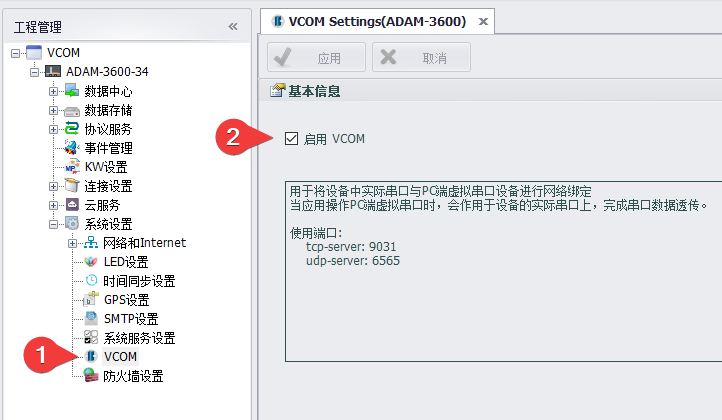

### 3. 在控制中心安装VCOM 管理程序

VCOM 管理程序是独立的安装包，官网的下载页面为：[https://www.advantech.tw/support/details/utility?id=1-24KJ5E7](https://www.advantech.tw/support/details/utility?id=1-24KJ5E7)，选择其中的 SetupEdgeLinkVCOM 开头字样的安装包下载即可。

安装完成后，在系统开始菜单启动项中可以找到 `Advantech EdgeLink VCOM Manager` 程序快捷方式，如下图所示。

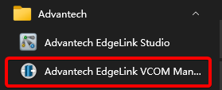

VCOM 管理程序主界面如下所示，左半部分显示在线设备的信息，包括设备名称、设备 IP 、串口代理程序（vcom-agent ）的版本号以及设备中包含的物理串口列表，右半部分显示管理主机当前已经创建的虚拟串口列表，其中包括与虚拟串口绑定的设备串口的状态信息。

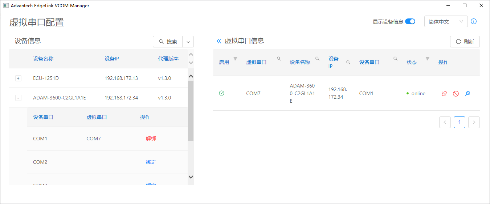

#### 3.1 搜索在线设备

点击界面上的搜索按钮可以搜索本地局域网内已开启 VCOM 功能的在线设备，如果设备不在本地局域网，则可以通过搜索按钮右边的下拉菜单来选择`按 IP 地址搜索` 或`按 IP 范围搜索`，下拉菜单中的`重置`命令可以用于清除当前的搜索条件和设备信息列表。

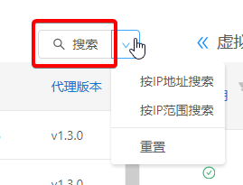

#### 3.2 绑定设备串口

在设备信息列表中，点击目标设备左边的`+`号按钮，可以看到该设备的物理串口列表，点击串口右侧的绑定命令，即可完成绑定。绑定的过程中，VCOM 管理程序会在管理主机上创建一个新的虚拟串口（系统会自动分配未占用的串口号，不可手动指定）。

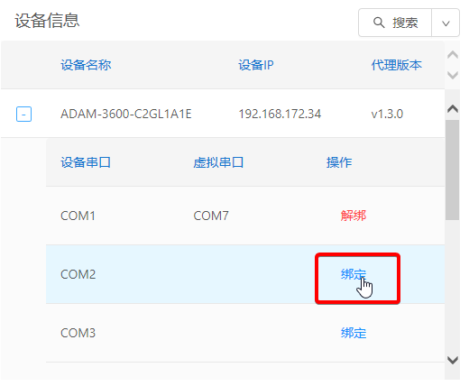

绑定后的串口，会显示在主界面右边的虚拟串口信息列表中，如下图所示。

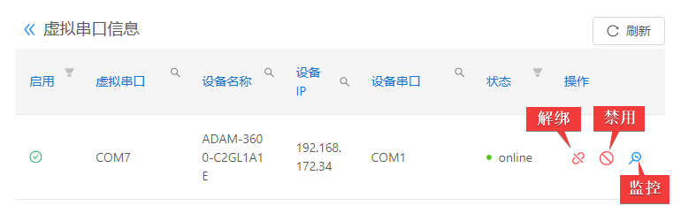

对于已经绑定的虚拟串口，有三种操作可以选择：解绑、禁用和监控。

* 解绑：解除该虚拟串口与物理串口的绑定关系，并从管理主机中删除该虚拟串口。
* 禁用：解除该虚拟串口与物理串口的绑定关系，但保留管理主机中的虚拟串口，有需要时可以重新绑定。
* 监控：显示该虚拟串口的监控画面，从中可以看到应用程序使用该串口发送和接收的数据字节，以便调试。

#### 3.3 解除串口绑定

上文提过，VCOM 功能是为了远程设备维护的用途设计的，当完成了远程设备维护任务之后，应及时解除串口绑定，否则会影响数据采集程序的正常运作。

解除绑定的操作，可以通过主界面左半部设备信息界面中对应的物理串口的解绑操作来完成，也可以通过主界面右半部虚拟串口信息界面中对应的虚拟串口的解绑操作来完成，这两处的操作结果是完全一样的，如下图所示。

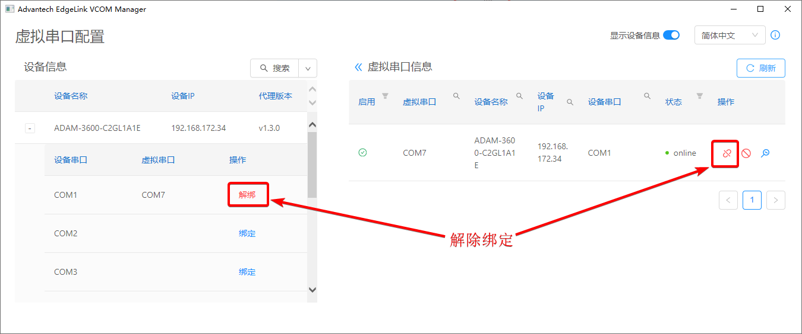

#### 3.4 禁用/启用串口绑定

如果只是想临时解除串口绑定，保留虚拟串口留待将来重新绑定，则可以选择禁用操作，如下图所示。

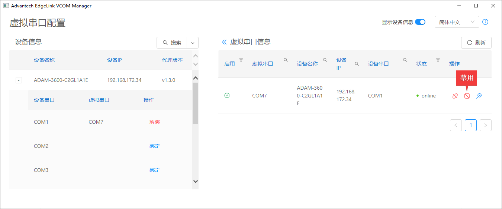

禁用后，该虚拟串口的不会消失，意味着虚拟串口依然存在，但其状态信息将会变为 `disable`，如下图所示，原本的`禁用`按钮也将会变为`启用`按钮，用于重新绑定该虚拟串口。

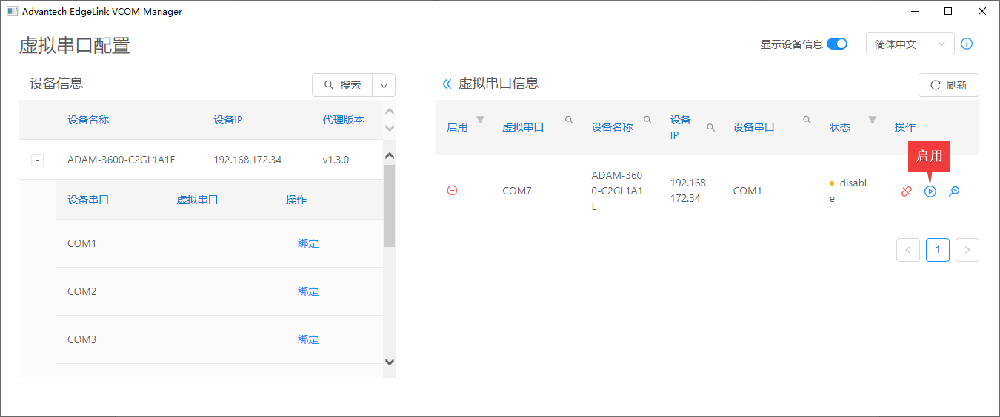

需要注意的是，禁用操作会导致物理串口跟虚拟串口之间的绑定关系被解除，所以当虚拟串口被禁用之后，左侧的设备信息界面中其对应的物理串口上的绑定操作是可以被执行的，如果此时在该物理串口上执行绑定操作，其将会被绑定到一个新生成的虚拟串口上，如下图所示：

1. 在物理串口上点击`绑定`操作
2. 将会新生成一个虚拟串口与之绑定
3. 此时尝试将之前禁用的虚拟串口重新启用
4. 将会收到一个绑定失败的错误信息，提示物理串口已被占用

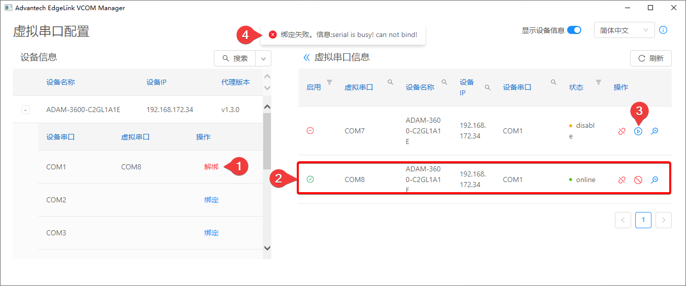

