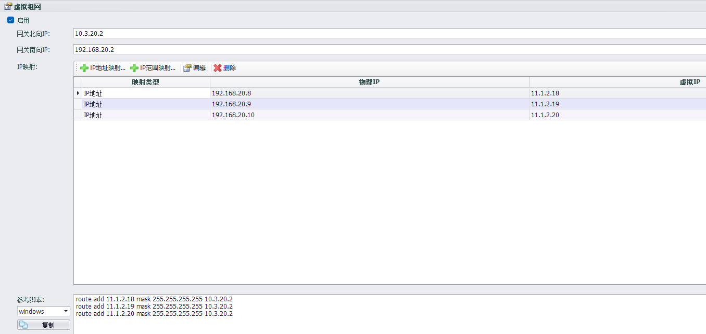

## 虚拟组网

### 虚拟组网用于远程运维PLC,经过配置实现控制中心到终端PLC的网络连接。即通过虚拟网络将控制中心与PLC组建在同一网络内。

第一步：先根据现场的物理连接以及网络环境进行虚拟IP的组网规划，如图举例说明：

第二步：打开EdgeLink Studio工程--->系统配置--->网络和Internet--->虚拟组网

第三步：完成配置并下载工程到网关

### 参数说明

#### 基本配置

- 启用：选择启用时，网关按照配置进行虚拟网络建立。
- 网关北向IP：网关与控制中心连接的网络IP。
- 网关南向IP：网关与南向设备的物理连接网络IP。

#### IP映射配置

- IP地址映射：添加物理IP与虚拟IP的映射 （按实际需要编辑IP地址）

   &emsp;&emsp;&emsp;    

   &emsp;&emsp;&emsp; 1.点击添加即可添加一条映射关系    

   &emsp;&emsp;&emsp; 2.修改添加个数后，点击添加，可以一次添加多条映射关系    

   &emsp;&emsp;&emsp; 3.点击确定，将映射关系加入到IP映射表格     
      

- IP范围映射：编辑IP映射范围  

   &emsp;&emsp;&emsp; 编辑物理IP与虚拟IP的网段以及子网掩码位数，调整组网范围      

   &emsp;&emsp;&emsp; 

- 编辑：编辑修改IP地址映射规则

- 删除：选中一条或者多条IP地址映射，点击删除即可删除

#### 控制中心配置

- 控制中心需要对应添加路由，以实现整体的虚拟组网应用，根据IP映射配置，EdgeLinkStudio自动生成对应的控制中心路由脚本（windows、Linux两个版本），复制该脚本在控制中心的电脑命令行中执行即可

