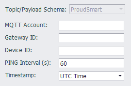

## Proud Smart

When connecting to the ProudSmart Cloud server, you need to configure the connection properties of the receiving server.

- **MQTT Account**: MQTT account name. Required field.

- **Gateway ID**: The name of the gateway to use for the connection. Required field.

- **Device ID**: The device name of the project in ProudSmart Cloud. Required field. 

- **PING Interval**: The interval at which the server sends a PING command.

- **Timestamp**: This option is used to control the timestamp representation format in the published message. UTC Time is expressed in UTC time and Local Time is represented in the local time of the device. For example, if the time zone of the device is set to East 8 (ie, Beijing time), the message is sent at 11:30:45 on January 1, 2018 Beijing time, then UTC Time will be 2018-01-01T03:30:45+0000, and the Local Time will be 2018-01-01T11:30:45+0800.

### Others

[Tag List](./others/TagList_Setting.html)   

[resume](./others/resume.html)

[export/import](./others/excel.html)