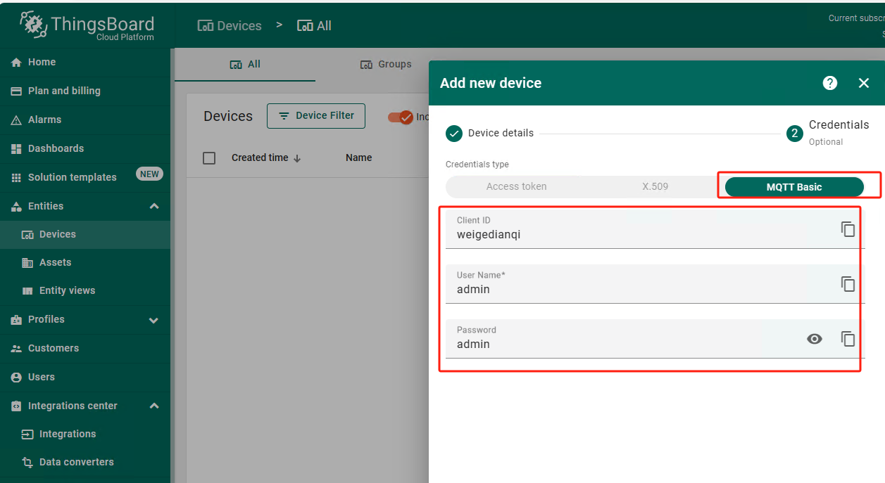
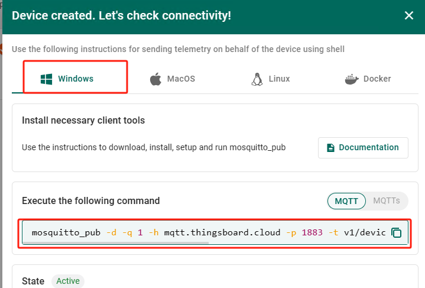
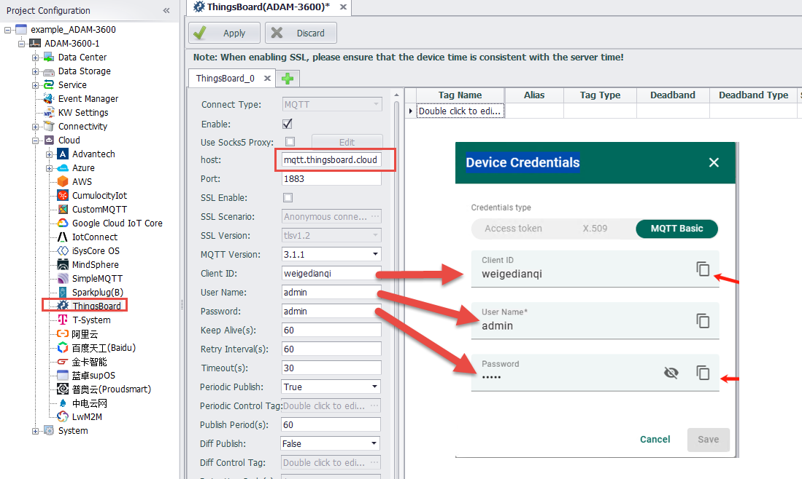

## ThingsBoard

ThingsBoard is an open-source Internet of Things platform for data collection, processing, visualization, and device management. It supports device connectivity through protocols such as MQTT, CoAP, and HTTP, and offers both cloud and on-premise deployment options.

### Others

[Tag List](./others/TagList_Setting.html)   

[resume](./others/resume.html)

[export/import](./others/excel.html)

Steps:

1. Log in to the ThingsBoard server and create a gateway device

2. Connect to ThingsBoard

