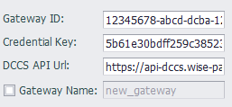

## DeviceOn/BI

The DeviceOn/BI cloud service plugin is used to upload data to the DeviceOn/BI platform.

Because the DeviceOn/BI connection requires the DCCS API to get the connection parameters, the connection parameters in the basic configuration will be ignored. Simply copy and paste the `Gateway ID`, `Credential Key` and `DCCS API Url` generated on the website into the corresponding fields to complete the connection configuration.

`Gateway Name` is optional. When not specified, the name of the gateway node configured in the project will be used.

DeviceOn/BI data uses a sub-device model to upload data. The name of the child device is distinguished by the colon (:) number in the tag name or alias. The name before the colon will be the child device name, and the name after the colon will be the actual uploaded point name. If there is no colon in the name or alias,  then `Gateway Name` will be used as the name of the child device.

### Others

[Tag List](./others/TagList_Setting.html)   

[resume](./others/resume.html)

[export/import](./others/excel.html)