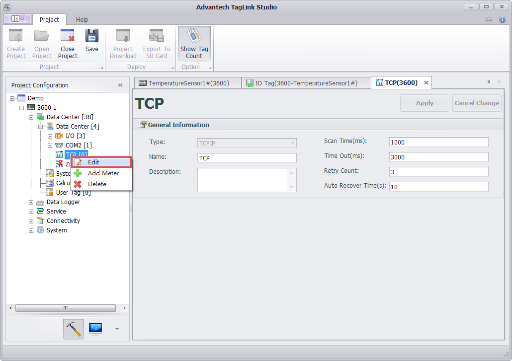
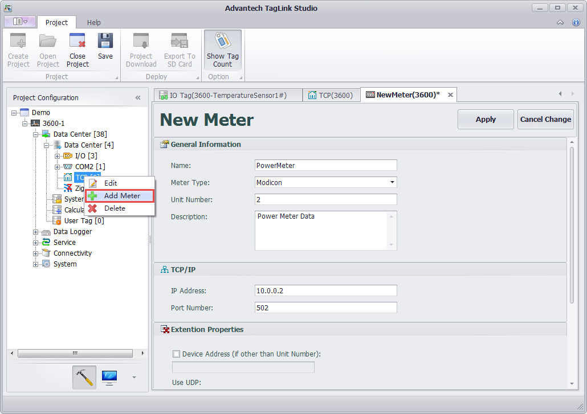
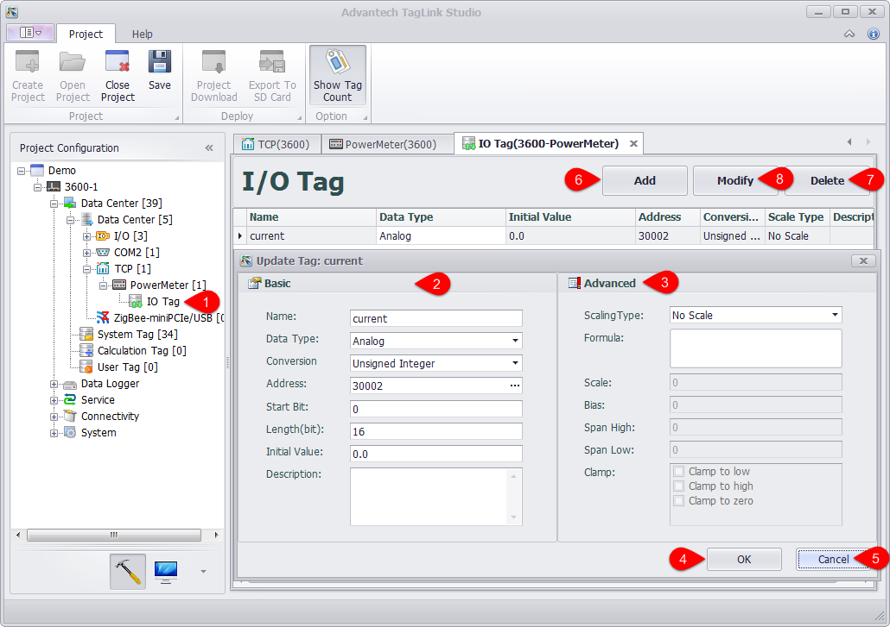
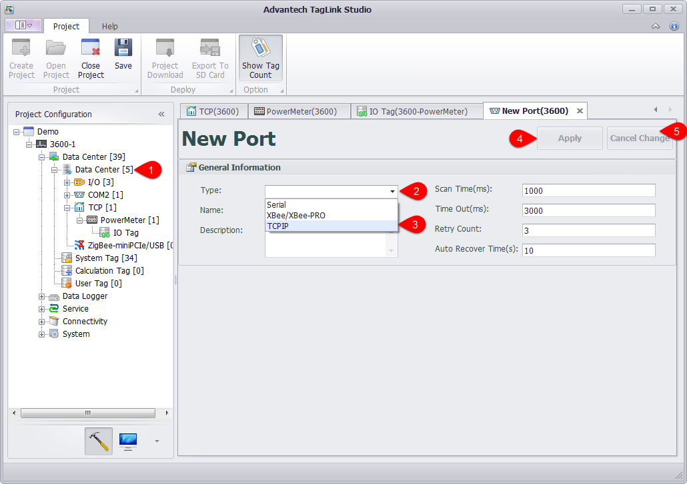

## Configure IO of Ethernet Devices

EdgeLink Studio supports to edit/delete the port via Ethernet and add device to it.

1. Right-click on the port name and select "Edit" to change the Ethernet port settings which are shown in below.

Note! This TCP port is a software port, so the quantity of its entity ports is not restricted to 2 . Users can freely add a new port as required.

2.	Right-click on the port name and select "Delete" to remove this port.

3.	Right-click on the port name and select "Add Device" to configure the Ethernet device, whose detailed settings are shown in the below figure.

4.	After a new device has been successfully added, users need to configure IO tag, the procedures of which are similar as for "Configure Onboard IO" (see below).

If users want to delete the newly added device, right-click on the device name and select "Delete" to remove it.

It should be noted that EdgeLink Studio supports one Ethernet port by default. If two or more Ethernet ports are required, users need to add new ports referring to the following procedures.

1. Right-click on "Data Center" and select "Add Port".

2. Select the port type and fill in the port name.

3. Give a description of the port, which is optional.

4. Then, click "Apply" button save the settings.

5. If users do not want to save the changes, click "Discard" button.

