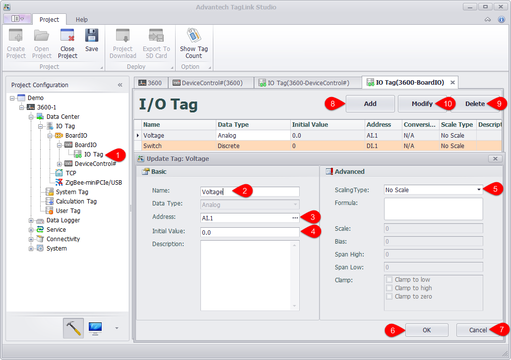

## Configure Onboard IO

In project configuration, users can add and configure IO tags based on the real input. The detailed operation procedures are as follows:

1. Double-click "IO Tag" in the left tree menu or right-click on it and select "Edit".

2. Fill in a tag name.

3. Select a tag address.

4. Set its initial value.

5. Select its scaling type.

6. Click "OK" button to successfully add the tag. Then this new tag will appear in I/O Tag list.

7. Click this button to cancel the changes.

8. Add another new tag.

9. Choose one or several tags to delete.

10. Choose one or several tags to modify.

* ADAM-3600 supports 8-ch AI, 8-ch DI and 4-ch DO.
* UNO-1372G supports 4-ch DI, 4-ch DO.

