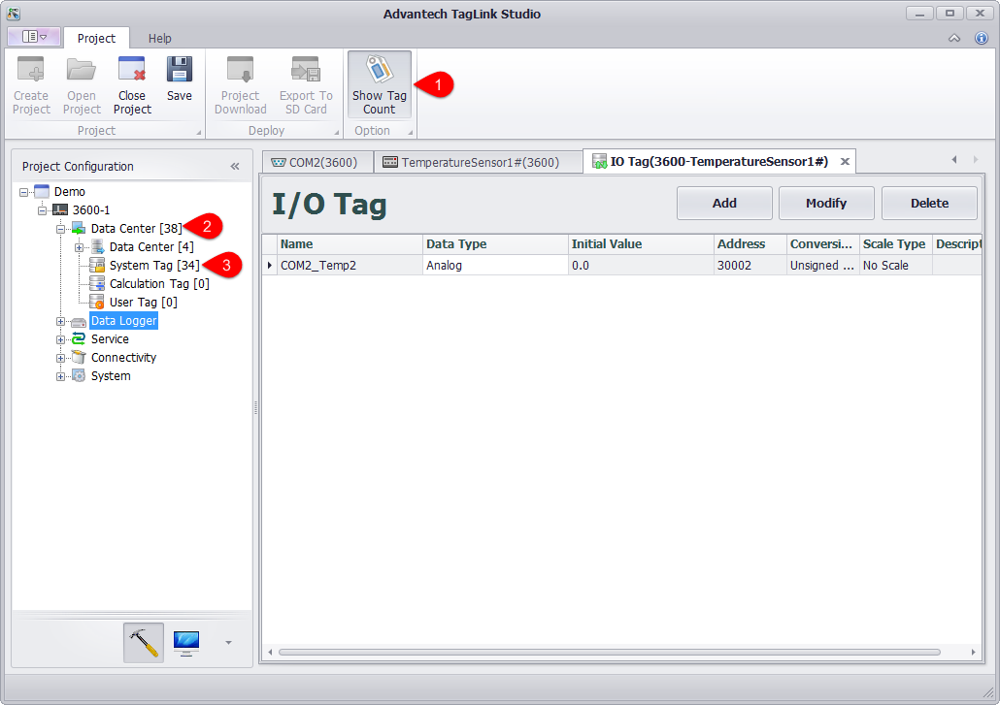

### 2.4.2 Displays the number of configured tags

In the navigation bar, displays the number of tags configured for each device in your project.

1. Click the button to show / hide the number of tags in the navigation bar.

2. The total number of tags configured in the device is shown in brackets after the Data Center node.

3. The node in the Data Center displays the number of tags that have been configured under this node.
