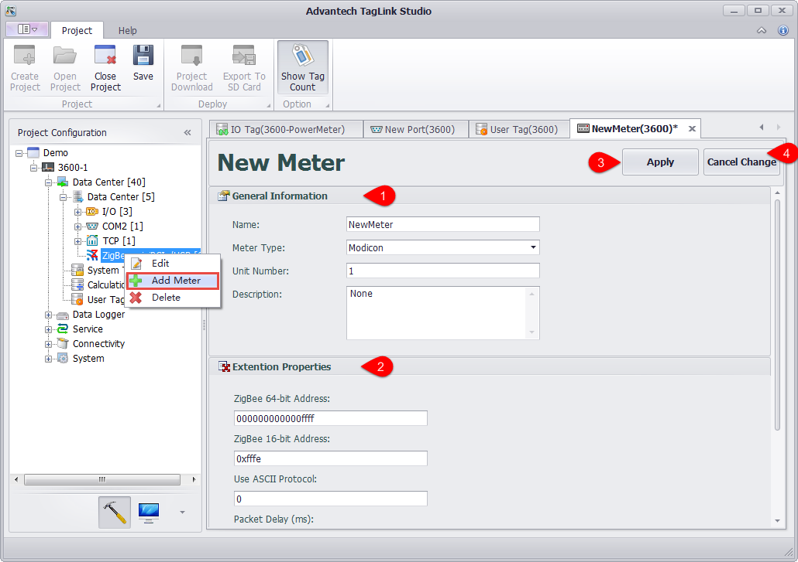
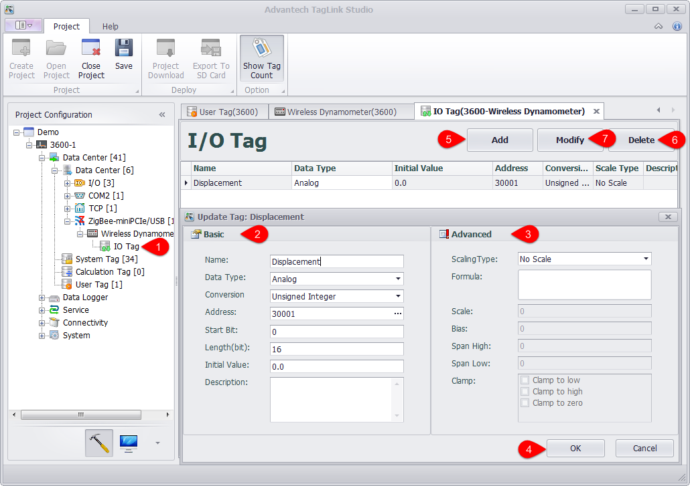

## Configure IO of Wireless Zigbee Devices 

For acquisition requirements of wireless Zigbee devices, users can right-click on the port name to edit/delete it and add device to it. 

a. The port settings are preset when Zigbee port was firstly added. If there is any information needed to be changed, right-click on the port name and select "Edit" to modify, then click "Apply" button to save the changes. 

B. Right-click on the port name and select "Add Device" to add a new Zigbee device. 

C. Add IO tag of wireless Zigbee device, the procedures of which are similar as for "Configure Onboard IO" (see below). 

1. Double-click or right-click IO tag to edit it. 

2. Fill in the basic information of the tag. 

3. Set the scaling type of the tag. 

4. Click "OK" button to add this new tag. 

5. Click "Add" button to add another tag. 

6. Select one or several tags and click "Delete" button to remove it/them. 

7. Select one or several tags and click "Modify" button to modify it/them.

The Zigbee wireless device supports configuring tags in the device template mode. For details, see 2.2.12 Device Template.