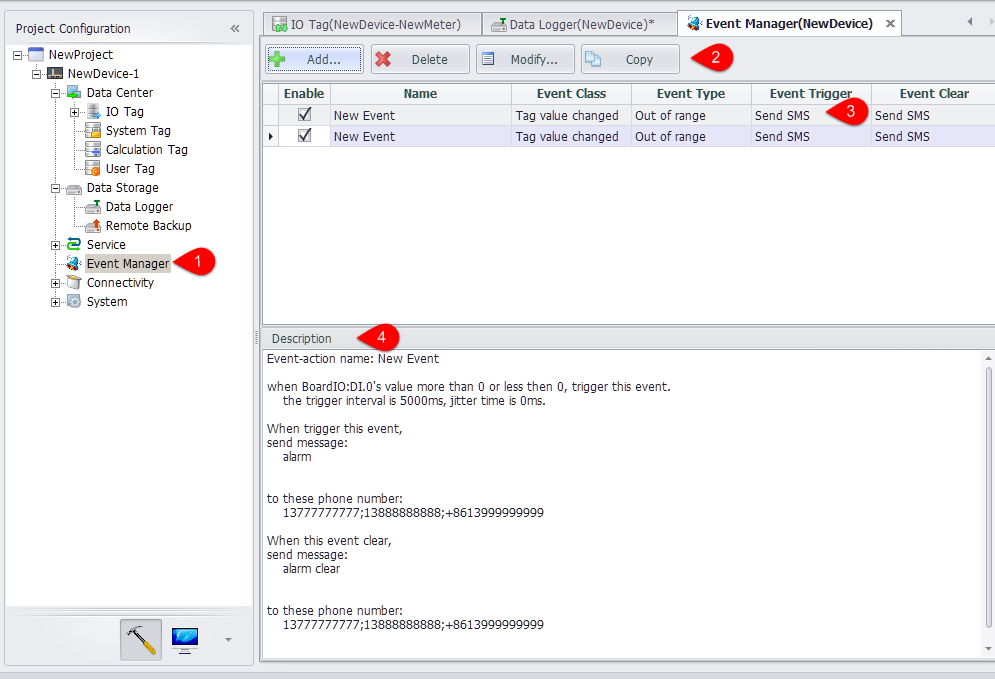
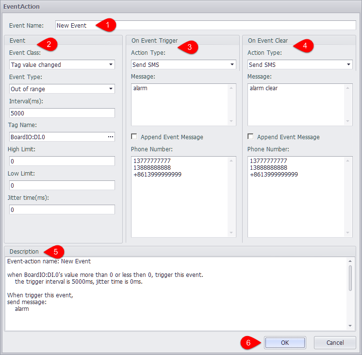
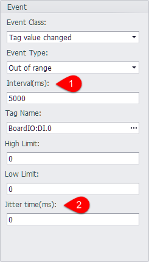
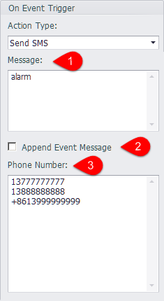
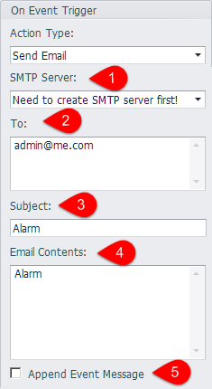

## Event Management

Event management pages allow users to set trigger conditions for events. Trigger events when conditions are met; The event is removed when the state transitions from the satisfaction condition to the non-satisfying condition.

### Event Management Page

1. Double click the "event management" node to open the edit page.
2. You can add, delete, modify, or copy an event.
	- Add: pop-up the event edit page, create a new event
	- Delete: delete the selected events
	- Modify: pop-up the event edit page, modify the selected event
	- Copy: copy the selected event and add it to the event list.
3. The time you have added will be displayed in the list. 
4. You can set whether this event is enabled when the device is running by clicking the "Enable" column of the selection box.
4. When you select an event in the list, the description of the event will be displayed in the description box.
5. After setting up, you need to click the "apply" button to save the settings.

### Event Edit Page

1. Edit event name.
2. The event parameters can be determined by selecting the event type and the specific time type.
3. Perform processing actions when an event is triggered.
4. You can also edit the actions that are performed when the event is lifted.
5. As with the event management page, the description of the event is refreshed in real-time in the description box.
6. When the settings are complete, click OK to save the settings.

### Supported Events
#### Tag Value Change

Currently support tag value change events. You can monitor the tag value out of range and tag quality is not good two cases.

1. Interval means that the same event is not triggered within an interval after an event has been triggered.
2. Jitter time means that the tag value exceeds the range or the quality is not good for the duration of time is less than the jitter time, then the event is not triggered.

### Supported Actions

 -  Send messages: supports sending SMS messages to designated mobile phone numbers

	

	1. Text messages to send to the phone.
	2. The details of the event can be added at the end of the text message after 
	
		Tag Name: #BATCH_WRITE_BoardIO  
    	Value: "current value"  
    	Quality: "current tag quality"  
    	Time Stamp: "timing of event"  
	3. After the event is triggered, the message will be sent to the number in this text box. If there are multiple numbers, it should be wrapped or separated by the ';' semicolon.

 - Send mail: supports sending an alert message to the specified mailbox via the SMTP server.

	

	1.  Select a configured SMTP server, if not configured, please refer to the SMTP server configuration section of this document.
	2. Please enter the standard mail format for the recipients section. If there are multiple recipients, please enter or use '; 'separation.
	3. Topic of alarm email.
	4. Contents of the alarm message to be sent.
	5. The details of the event can be added at the end of the email:
	
		Tag Name: #BATCH_WRITE_BoardIO  
    	Value: "current value"  
    	Quality: "current tag quality"  
    	Time Stamp: "timing of event"  