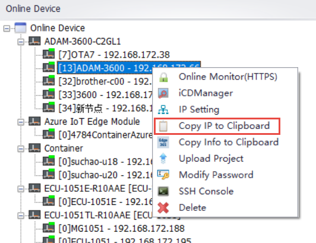
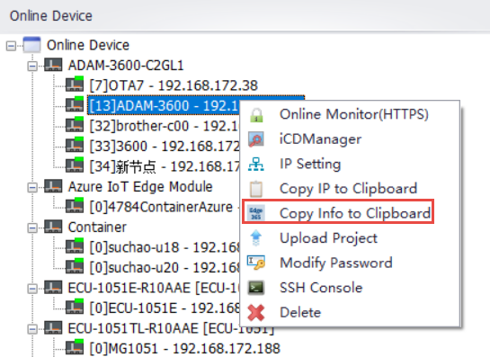

## Copy Device

Users can copy device information to the pasteboard for later use.

### Copy the IP address to Clipboard, for example: 192.168.172.66

### Copy the device information to Clipboard, this information is currently used when Edge365 creates an EdgeLink device (supported in versions 2.8.2 and above).

The information format is as follows:

{
  "name": "", \
  "description": "", \
  "mac": "", \
  "type": "EdgeLink" \
}

