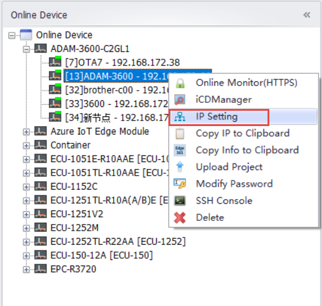
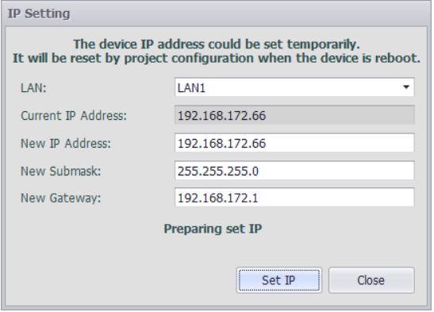

## IP Setting 

Users can temporarily modify the IP address and subnet mask of the network port of online devices through EdgeLinkStudio. For example, the two network ports of RTU are set to DHCP mode (dynamically assigned IP), but there is no server in the network that can provide DHCP services. At this point, the RTU can be searched, but not accessed by IP. At this time, the user can temporarily set the IP address of the RTU for operations such as downloading projects.

>**Note**：This setting expires after the RTU is rebooted. After restarting, the RTU sets the network port status according to the configuration document

1. Right-click on the online device that has been searched, click Set IP, and open the "Set IP" pop-up box.

2. In the Set IP pop-up box, the user first selects the network port to be modified, and then enters the new IP address and subnet mask.

