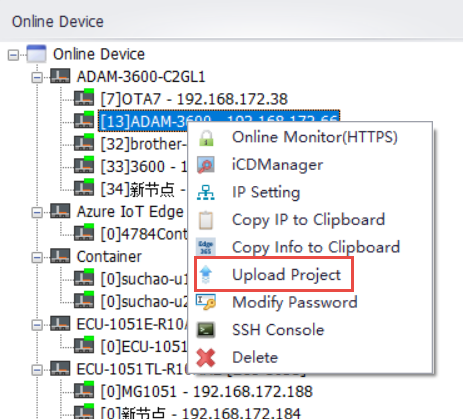
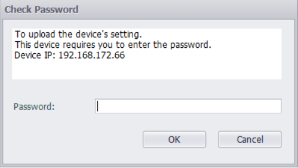
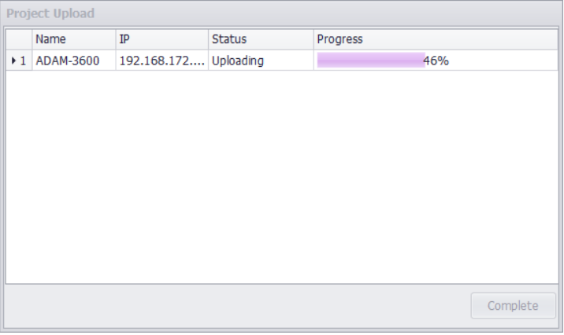

## Upload Project

Users can upload the current device project on the device to EdgeLink Studio.　

1. Right-click on the already searched device and select "Upload Project" in the Online device list to start uploading device information.
	
	

2. Before loading the device information, the user needs to enter the password of the current device and verify that it is correct before uploading.
	
	

3. The current upload progress is displayed as a progress bar while uploading.
	

4. When the upload is complete, the uploaded project is displayed in Project Management.

	- At this point, if there are no open projects in Project Management, a new project is created with the uploaded equipment information.

	- If you already have an open project, an attempt is made to save the device information in the existing project after the upload is complete.