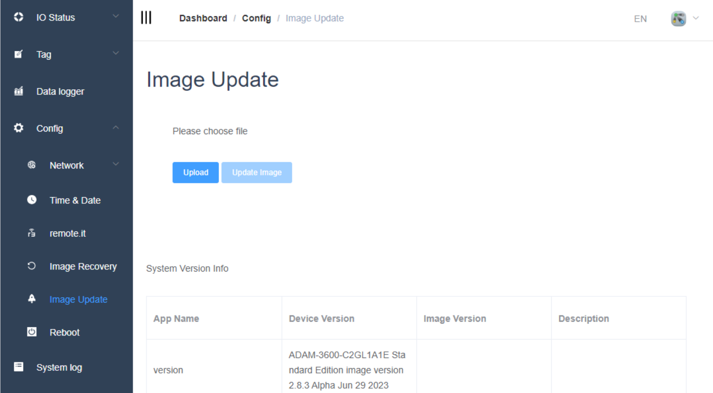
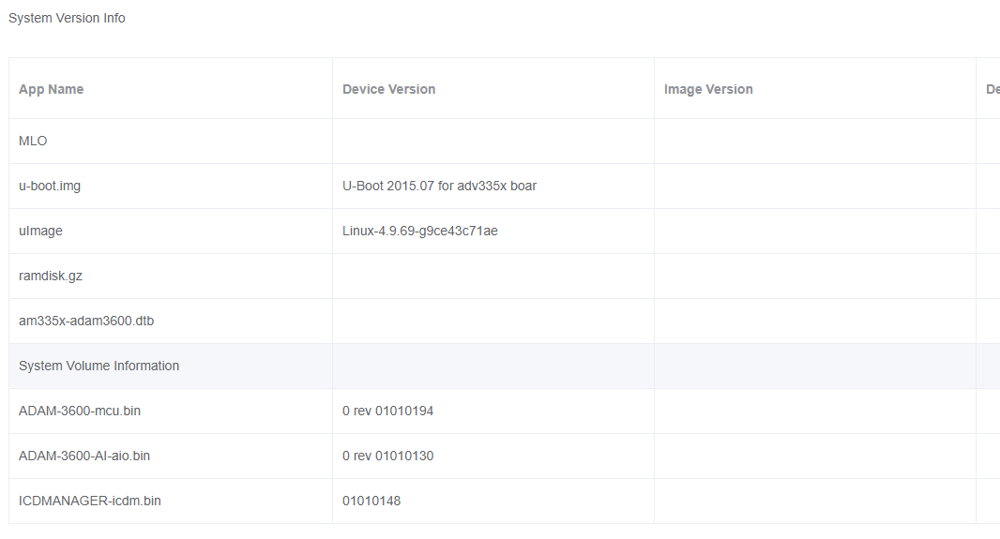
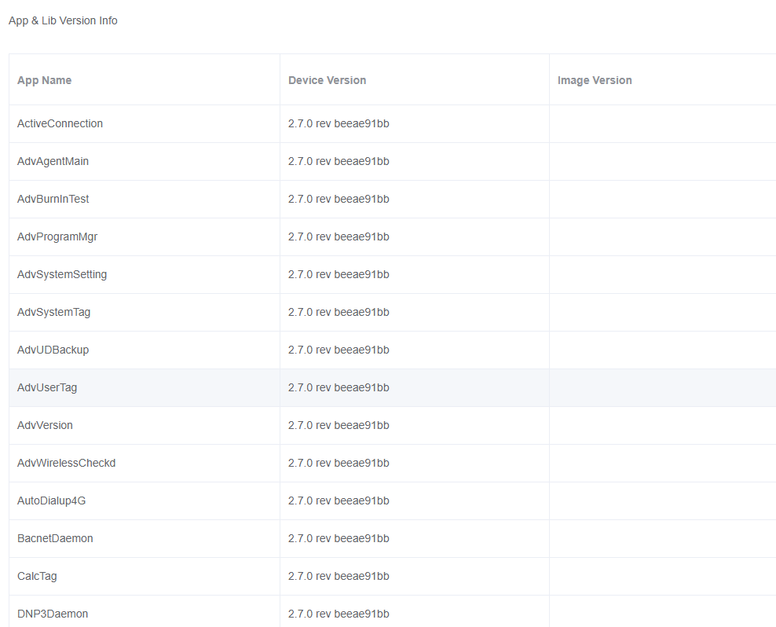
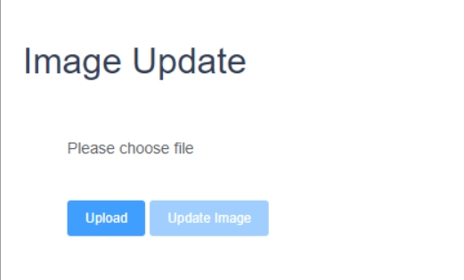
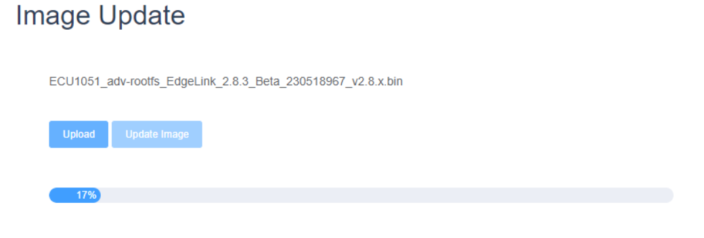
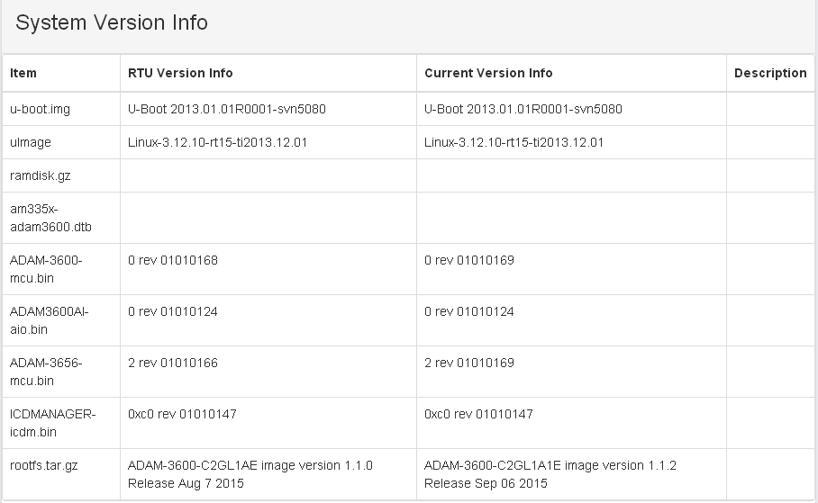
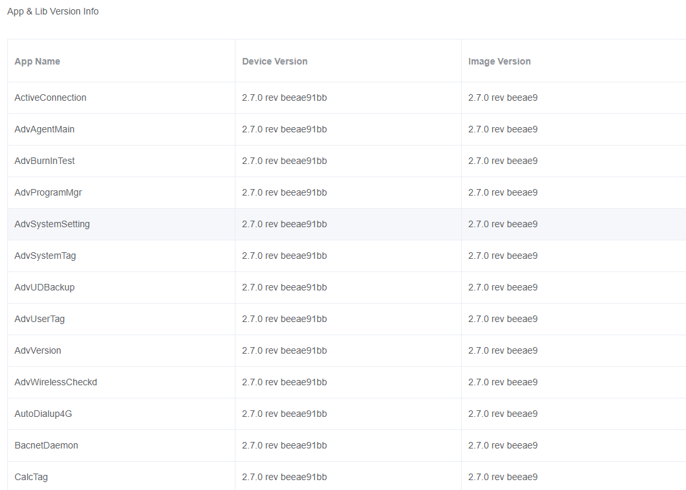
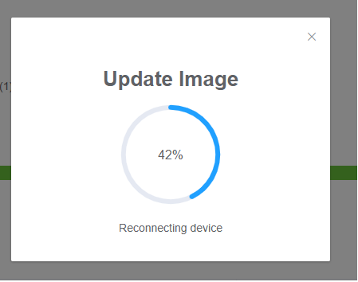
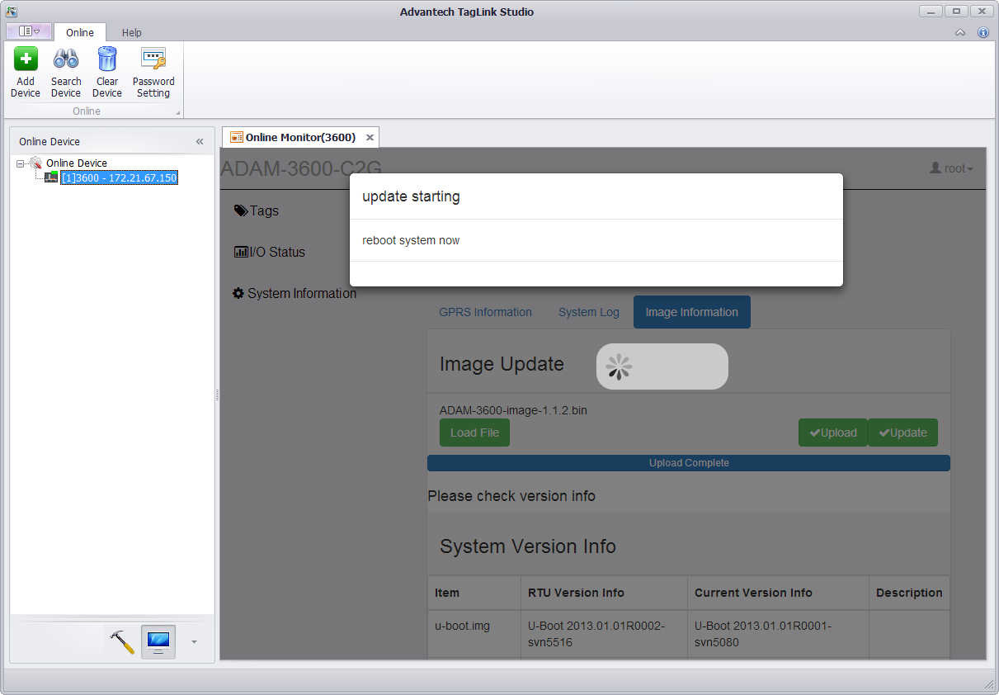

## Image Update　

The Image update page displays all system version and software version information of the current device, and can realize online firmware and software updates.

### Information

The system version information of the current device is displayed as follows:

The software version information of the current device is displayed as follows:

### Image Update

>**！Note**：You must first log in for this operation

1. Click Upload to select the bin file to be updated.

	

3. The process of uploading the file is shown below, and the whole process takes about a few minutes.

	

	

	Before updating, you can choose whether to check 'Restore factory default settings', if checked, the original configuration will be cleared after the upgrade.

4. If the file is successfully uploaded, the 'Update Image' button will be displayed, as shown in the red box above. At the same time, the version number of each file in the uploaded package is listed, as shown in the following figure.

	

	

5. Click Update to start the Image update, and the update process is shown in the following figure.

	

	

6. After the update is complete, the EdgeLink device will restart, and after restarting, it will jump to the login interface, and the user can log in before performing subsequent operations.
