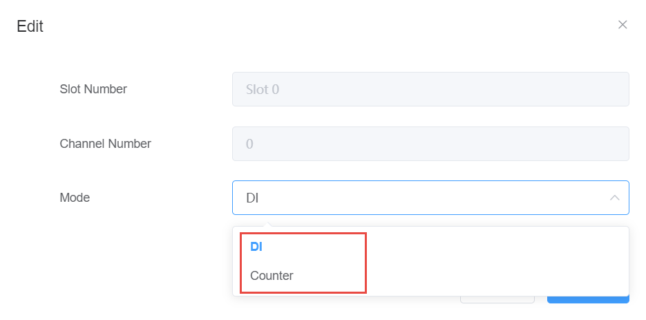

## DI data acquisition and parameter setting　

The data of the DI module is displayed in the figure below. The data form items are as follows:

 - Slot number: The module where the DI function block is located, slot 0 is onboard.

 - Channel number: DI channel number.

 - Mode: Normal (i.e. DI) or Counter.

 - Signal Status: DI port level value.

 - Value: In Normal mode, the collected DI value is displayed here; Counter mode, the count value is displayed here.

	

   When you need to configure parameters, click the Edit button to set the working mode of this DI channel

   

   When the DI channel operating mode is Counter, you can choose whether to enable Counter counting by starting counting:
   
   Green is enabled, and if enabled, the DI channel is counted if there is an input
   
   Red is not enabled, and DI channels do not count

   

   Note: After the parameter is modified, you need to click the Confirm button to take effect

