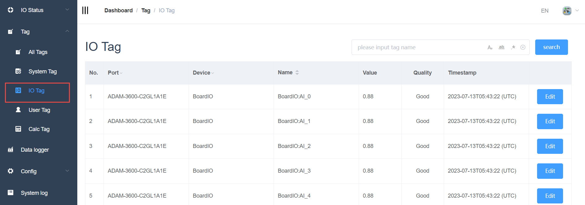
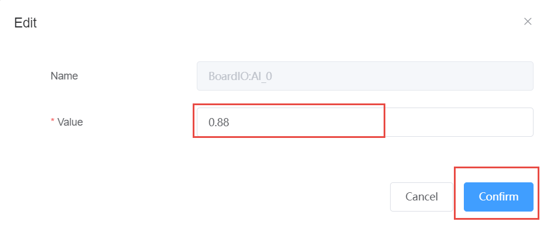

## IO Tag  reading and setting　

Support the reading and setting of IO tags, for the tags that need to be edited, you can click the edit button at the end of the corresponding point to enter the editing interface:

### Search of Tags：

[Tag Search](./tag_search/tag_search.html)
