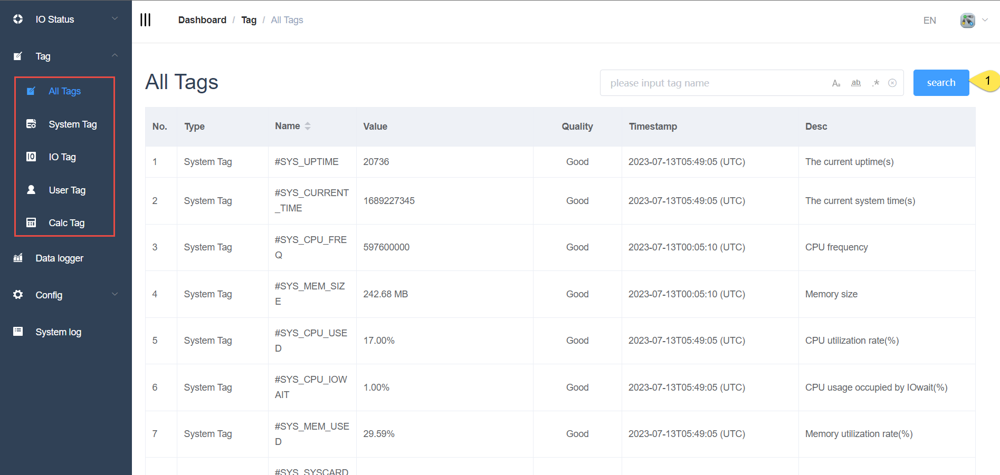
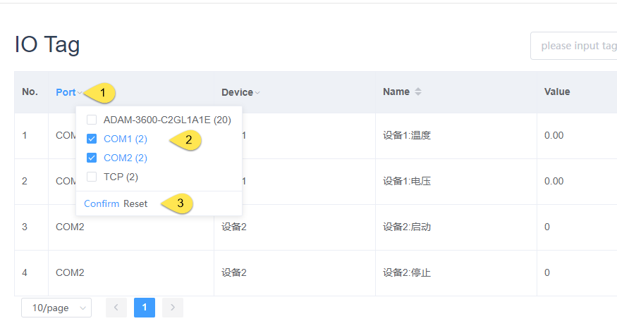
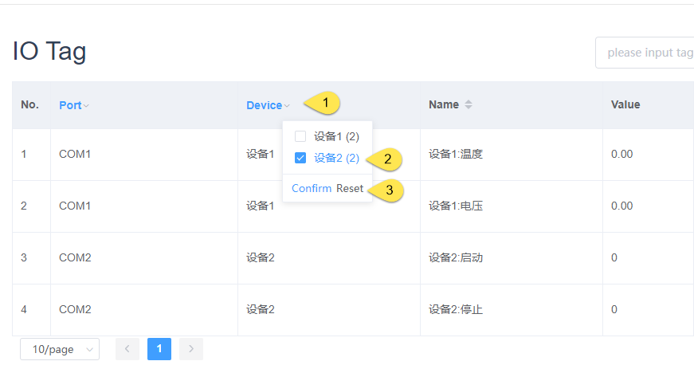

## Tag Search

#### All pages of tags support searching by tag name

#### Type

Type 1: Match Case

Type 2: Match Whole World

Type 3: Use Regular Expression

### Search of IO Tag

In addition to searching by tag name, the IO Point page supports filtering based on ports and meters

|  button |  Description |
|  ----  | -------------------------------------------------------------------  |
| Confirm  | After checking the port list, click the Confirm button to take effect
| Reset | Click the reset button to uncheck all checks, that is, to revert to the state of no filtering|

