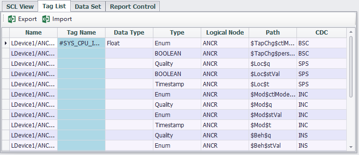

### IEC-61850

EdgeLink can work as IEC-61850 Server to exchange data with IEC-61850 Client of HMI/SCADA.

Here will explain the application of IEC-61850 Server in detail.

Double-click "IEC-61850" under "Service" item in the left menu tree to pop up the configuration interface.

#### Config IEC-61850 Services

To configure the IEC-61850 service, you need to check Enable first, and then configure the basic information and security configuration of the server.

Most of the IEC-61850 configuration will be reflected in the ICD file. The import and export function of the ICD file is provided here, allowing users to import the generated ICD file into the service and use it directly. It should be noted here that the IEC-61850 service in EdgeLink only supports one IED in one ICD file, and this IED only contains one LDevice.

General settings for configuring the IEC-61850 server on the Basic Configuration page, including:

- Port
- Max Connections
- IED Name
- LDevice Inst

##### Security

Supports three security modes：

1. None
2. Password
3. Certificate

Password security Mode only verifies passwords

In the certificate verification security mode, users need to configure the CA certificate file and the MMS certificate file. 

Users can choose whether to enable TLS.

#### SCL Settings

The user will configure the IEC-61850 model, data set and report on this page, and an ICD file based on SCL language will be generated when the project is compiled.

EdgeLink Studio's IEC-61850 service supports only one IED in one ICD file, and this IED also contains only one LDevice. Only this one LDevice is configured in "SCL View". When the IEC-61850 service is enabled, this LDevice will be created automatically, and the LN0 node and the LPHD node of the LDevice will be created at the same time.

Click "Add" to insert a logical node LN for LDevice:

Users can switch the type through "Logical Node Type", and check the DAI nodes to be configured at the same time.

After adding the LN, the user needs to bind the tag to the DAI node. Double-click the tag name cell in the DAI to select the existing tag in the project and configure the data type in IEC-61850.

The Tag List page lists all the DAI nodes that have been added, and users can also easily bind tags to DAI in the Tag List page.

At the same time, it provides the function of importing and exporting Tag List to Excel, and users can quickly bind DAI and tags in EXCEL.

#### DataSet

DataSet represents a table organized by the data contained in each logical node. There are many signals in the table, and each signal is accurately represented by a string of paths of "LDevice/LN\$FC\$Branch\$Leaf" .

When adding a dataset, the added data model will be listed on the interface, and the DAI selected by the user will be added to the dataset. Users can also filter the added datasets on the left.

#### Report

Report controls how and when these datasets are sent.

#### ICD Import \& Export

The user can click the "Export to ICD file" button to export the configuration. Click "Import from ICD file" to import the ICD file configured in other software. However, when the imported ICD file has multiple IEDs or multiple LDevice nodes, only the first LDevice configuration of the first IED will be imported.