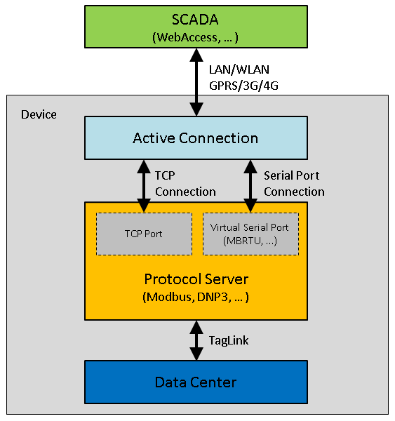
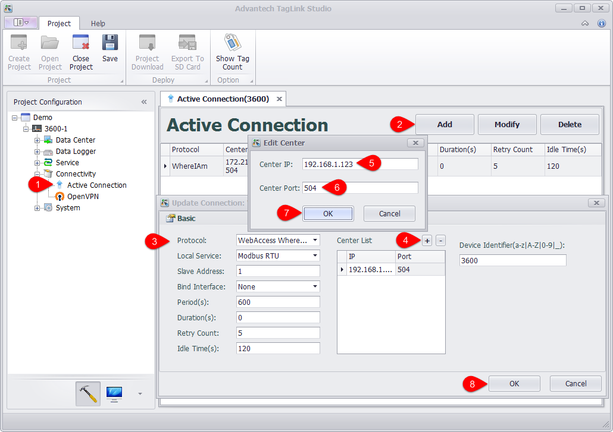

## Active Connection

The main application scenario of active connection: RTU can directly access SCADA center, while the latter has no direct access to the former. RTU connected via cellular wireless connection or RTU behind the firewall is such kind of situation. In this case, the traditional TCP connection created by SCADA is not applicable any more. It should be the responsibility of RTU to actively connect with SCADA which will access data in future through this connection. 

The fundamentals of active connection is illustrated in the below figure. In active connection, two connections will be established: one is the connection with a service of the device over TCP port or virtual serial port, which is called upward connection; the other is the connection with SCADA center, which is called downward connection. After the establishment, active connection will perform the data forwarding between two connections. Downward connection adopts the standard TCP connection, so it can support all protocols that listens on TCP port, including Modbus TCP, NDP3, etc; while upward connection supports two protocols: one is WhereIAm protocol, used to connect with WebAccess; the other is DTU protocol of FourFaith, used to realize the connection with the server which supports four faith DTU. More upward connection protocols will be added in future.

### Active Connection Settings

In active connection page, the items that should be configured include upward connection protocol, downward connection service, center list of upward connection as well as some related parameters. Please follow the below steps to add an active connection:

1. Locate "Active Connection" in "Connectivity" in the left tree menu, and then double-click it to open the configuration page.

2. Click "Add" button to add an active connection

3. Set the related parameters of active connection, including:

	- Protocol: Select the upward connection protocol from the drop-down list. "WebAccess WhereIAm" is used to connect with WebAccess server, while "DTU - Four Faith PROT" is used to connect with four faith DTU server. Different protocol requires users to set different parameters in the lower right corner of the page. For WhereIAm protocol, users only need to set one parameter: "Device Identifier" which should be consistent with the device name in WebAccess project so as to make sure WebAccess can correctly identify every connected device.

	- Local Service: Select the downward connection service from the drop-down list. "Modbus RTU" means to connect with Modubus RTU through the virtual serial port, while other options realize the connection through TCP connection.

	- Salve Address: This item is only available when "Local Service" is set to "Modbus RTU". It specifies the slave address of Modbus RTU.

	- Bind Interface: Specify the communication port of active connection. "None" means no port is binded. This parameter is typically used when a device has multiple network connections, the data channel of active connection should be explicitly specified to avoid the uncertainties of the system default route. For example, if "Cellular" option is selected, only cellular wireless network can be applied to data transmission. 

	- Period (s): Set the time interval for active connection to establish a second upward connection.

	- Duration (s): Set the time duration before the upward connection is disconnected. "0" means the connection will never be actively disconnected after it is established. 

	- Retry Count: Set the retry times after an upward connection is failed. If the count is exceeded, active connection will never try to reconnect again until the next period comes.

	- Idle Time (s): After an upward connection is established, if there is no data transmission within the specified idle time, active connection will disconnect and try to reconnect. "0" means no idle time is set.

4. Click "+" button to add center IP and center port of the upward connection.

5. Enter a center IP, which can be either an IP address or a domain name address.

6. Enter a center port. If WebAccess is used, this item is usually set to 504 by default.

7. Click "OK" button to add the center information to "Center List". Repeat steps 4~7 to add more centers. Each active connection can support at most 5 centers. 

8. Click "OK" button to add this new connection to active connection list.

