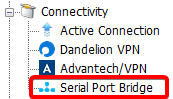
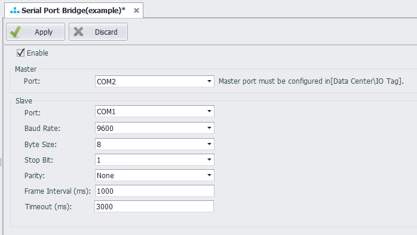

## Serial Port Bridge

Serial Port Bridge is mainly used to add a gateway for data acquisition while retaining the existing serial port connection logic. As shown in the figure below, a gateway is added between the HMI and the end device, by bridging the serial ports in the gateway, the original HMI data acquisition is not affected, and the gateway can also read data from the end device..

### Principle

The serial port bridge program will open two serial ports, one is the slave port connected with the upper master station, and the other is the master port connected with the lower-level end device. When the serial port bridge program receives a request from the upper master station from the slave station port, it will forward the data message to the master station port, accept the response data of the end device, and return it from the slave station port to the upper master station.

Because the serial port is an exclusive resource, in order to realize that the data center of the gateway and the upper master station can collect data from a lower-level collected device at the same time, the serial port bridge program needs to share the same master port with the data center, using time-sharing multiplexing. Because the master station port is used in time-sharing, the scan time of the data center and the upper master station should be coordinated when using the serial port bridge program, otherwise the data acquisition result will be affected.

### Settings

The serial port bridge function is located in the connection settings of the project configuration tree, as shown in the following figure:

Double-click the serial port bridge setting item in the project configuration tree to open the serial port bridge configuration page, and click "Enable" to configure the serial port bridge.

Parameters:

- **Master - Port**: select a serial port that has been configured in the data center for acquisition.
- **Slave - Port**: select a serial port that has not been added to the data center and is not occupied by other applications to be used as a slave port.
- **Baud Rate/Byte Size/Stop Bit/Parity**: set according to the actual connection with the upper master station.
- **Frame interval (ms)**: specify the minimum interval for data requests from the upper master station, in milliseconds. The serial port bridge program will split the complete data message received from the slave station port according to this setting parameter.
- **Timeout (ms)**: specify the timeout time of waiting for response from the end device, the unit is milliseconds. After the serial port bridge program forwards the message, if the waiting time for a response exceeds this set parameter, it is considered that the end device has no response. At this time, the serial port bridge program will release the occupation of the master port so that the data center can continue to do data acquisition.
