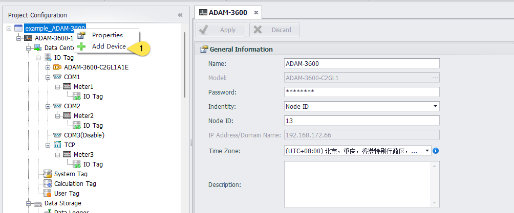
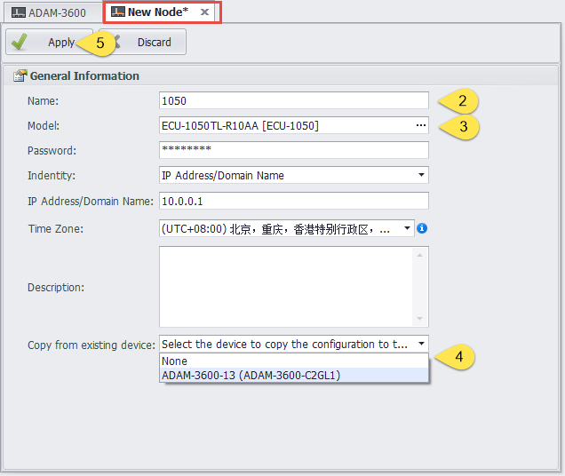
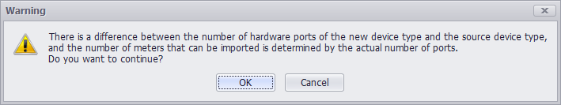
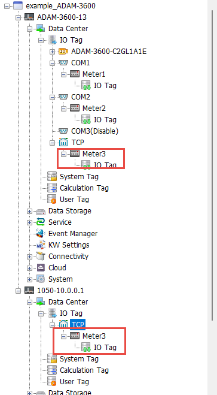

## copy from existing device

1. At this time, there is already a device in the project file: ADAM-3600-13, right-click the project name to add a new device.

2. Enter the device name.

3. Select the type of device you want to add.

4. Copy the file from an existing device

5. Apply

When the device type is inconsistent, the following picture will be displayed. If you confirm the creation, click OK

At this time, a new device is added to the project. The model is the model selected during the addition, and the configuration information is copied from ADAM-3600-13 (the number of ports is determined by the model selected during the addition).

