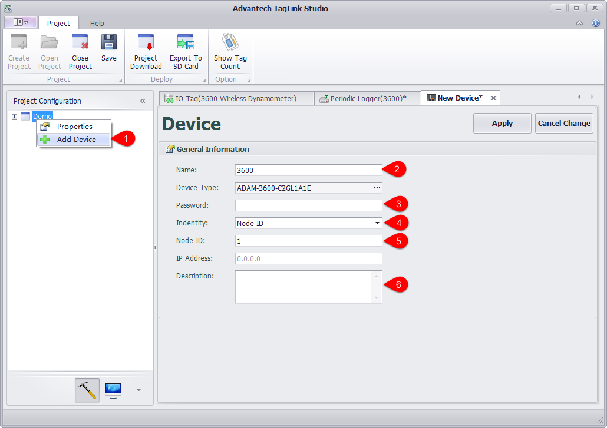
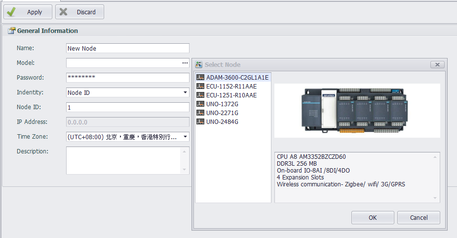

## Add Device and Edit Information

1. Right-click on the project name to add a device.

2. Enter a device name.

3. Enter a password. This default password is 00000000. Users can change the password referring to [3.1.4 "Password Setting"](../OnlineFunctions/OnlineConfig/PasswordSetting/PasswordSetting.html). After the password is changed, users need to enter the new one to download the project. 

4. Here allows users to identify the device by Node ID or IP Address.

5. Enter the corresponding Node ID or IP Address.

6. Select the time zone in which the device is located.

7. Fill in the device description (optional).




#### Identify Types ####

- Node ID：

  

  When downloading, search the network for the device IP with node ID as the configuration value, and download the project to this device.

  

- IP Address/Domain Name：

  

  You can download the project to the configured device with the device IP or domain name. When using remote.it or devices in the gateway with port forwarding service to download the project, the port number can be configured, such as:

  ```
  adam3600-generic-tcp.at.remote.it:30000
  ```

- Azure

  

  You can download the project to the device through azure cloud service. You need to configure the primary connection string in iothub and the device ID in iothub.


  IotHub Connect String：

  


  IotHub Device ID：

  

