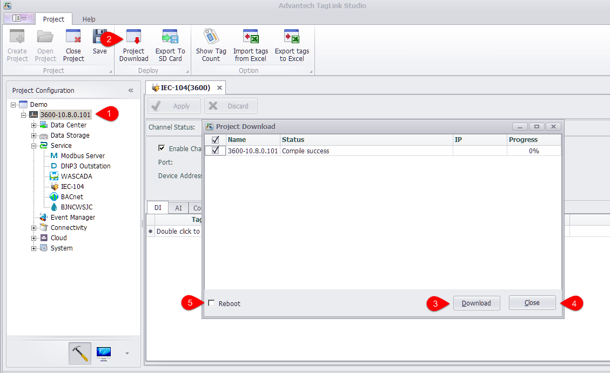

## Project Download 　

After the device has been identified, users can download the device information to the relevant device. Batch download function is supported. If users select a project on the left tree menu and then click "Project Download", a dialog will pop up listing all RTU devices for batch download; if users select a certain device and then click "Project Download", a dialog will pop up with only one RTU device to be downloaded. 

1. Select a device.

2. Click "Project Download".

3. Click "Download" button to start downloading.

4. In "Project Download" dialog, "Progress" shows the current download progress. When complete, click "Close" button.

5. In "Project Download" dialog, "Reboot" allows users to set whether to reboot the device after the downloading is complete.

