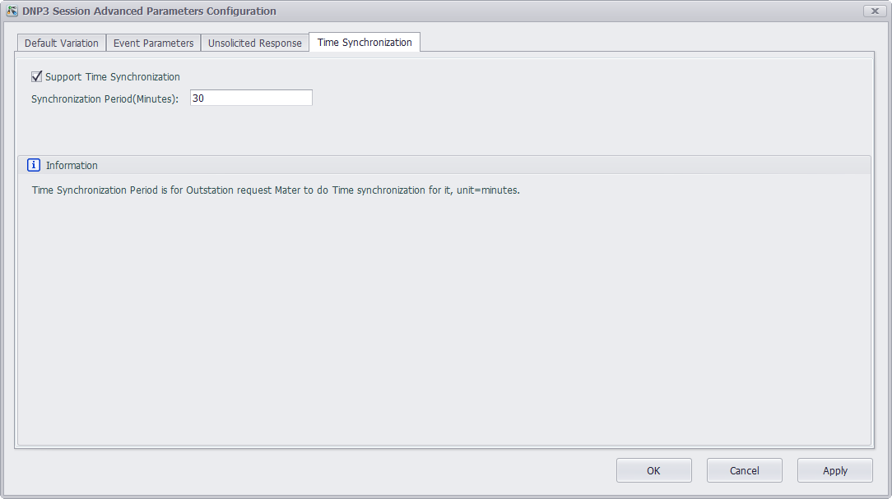

## DNP3 Server 

ADAM-3600 can work as DNP3 Outstation (hereinafter referred to as DNP3 server) to exchange data with DNP3 Master of HMI/SCADA (hereinafter referred to as DNP3 client). Current version of DNP3 server has passed DNP3 Level 2 test. 

Here will explain the application of DNP3 Outstation in detail.

1. Double-click "DNP3 Outstation" under "Service" item in the left menu tree to pop up the configuration interface.

	

2. The main configuration interface of DNP3 server is shown as below. Some terms appeared here should be explained:

	

	- Channel: 

	It represents the media of DNP3 server to communicate with the outside. Current version of DNP3 server only supports Ethernet communication which indicates TCP/IP network communication protocol by default.

	Slave Station: It is DNP3 server address. DNP3 protocol specifies that source address and target address of DLL should be set. If users are not quite familiar with this part, please keep the default settings.

	Port number: It is the port number of TCP/IP communication on DNP3 server. The default number is 20000.

	- Session: 

	Here the supported number of sessions means at most 4 DNP3 clients are supported to communicate with DNP3 server at the same time. Users should set an appropriate number of sessions based on real needs to avoid extra idle sessions, so as to less burden the CPU and improve the operating efficiency of EdgeLink. 

	Enable: Users need to tick "Enable" option to give the right to DNP3 client to access this session. 

	Master Station: It is DNP3 client address. DNP3 protocol specifies that source address and target address of DLL should be set. If users are not quite familiar with this part, please keep the default settings.

	- Database: 

	Each session has an independent database, allowing users to classify DNP3 points and configure their properties based on the pre-configured tags and DNP3 points mapped to DNP3 server. 

	> Note: Please keep the total number of DNP points in all sessions less than 2000 so as to ensure the operating efficiency of EdgeLink.

3. Next will describe the detailed settings of each term.

	- Channel Setting

		Session Status: There are in all 4 sessions here. When any of them is enabled, it will turn green to show its status: read-only.

		See the below screenshot.

		

	- Session Setting

		Before starting to edit a session, users should select a session from the drop-down list. The default setting is Session 1. Please tick "Enable" box first,

		

		then choose whether to show and use 6 categories of DNP3 points. The box before each category allows users to select to show or hide points in the editing interface below; while the box after allows users to set the number of DNP3 points. The studio provides 8 BIs, 8 AIs and 4 BOs by default, and all BI points are shown in the editing interface. "Show/Hide All" determines whether to show all points in each category in the editing interface, to avoid a long list which may in turn affect operation convenience of users. See the below screenshot:

		

		[Duplicate Session1]: 

		When users want to configure multiple sessions which are basically similar, please click this button to clone session 1.

		[Clear Session]: 

		When users make too many configuration errors, please click this button to clear the session and re-start editing. Note: This operation can't be undone, please operate with care.

		[More Parameters]: 

		For advanced users who want to customize DNP3 service, please click this button to pop up "DNP3 Session Advanced Parameters Configuration" page which includes four part:

		1. [Default Variation]

			Click this tab to show the default data type of each DNP3 group. "Information" box provides the related description and remarks. For more detailed information, please refer to Appendix A DNP3 data object library -- object descriptions in DNP3 protocol (This manual refers to 2012 version of DNP3 protocol. Different version may vary in chapter arrangements).

			

		2. [Event Parameters]

			Click this tab to configure the behavior pattern parameters of the events created by DNP3 point groups. "Information" box provides the related description and remarks. For more detailed information, please refer to 4.1.5.2 Events in DNP3 protocol.

			

		3. [Unsolicited Response]

			Click this tab to choose to enable the unsolicited response function of DNP3 server based on the premise that DNP3 client actively enables this function of DNP3 server. Users can select the class (Class 1, Class 2 and Class 3) to implement this function. "Information" box provides the related description and remarks. For more detailed information, please refer to 4.6 Unsolicited Responses in DNP3 protocol.

			

		4. [Time Synchronization]

			DNP3 protocol supports time synchronization function by default. Click this tab to choose whether to enable this function on DNP3 client end. If the box is ticked, the default setting is 30 minutes, which means the synchronization will be carried out every 30 minutes. The length of synchronization time depends on the requirements of time precision in users' application. "Information" box provides the related description and remarks. For more detailed information, please refer to 10.3 Time Synchronization in DNP3 protocol.

			

	- [Database] Editing of Session

		1. DNP3 point in each session should be associated with a tag. Double-click on a cell in "Tag Name" column to add a tag.

			

		2. After the association, the changes of "Switch0" will be sent to [BI0] of DNP3 point. Columns of "Event High Limit", "Event Low Limit" and "Event Deadband" are only effective for Analog Input; while for other columns, please keep the default settings.

			

		3. For analog input event of DNP3 point, DNP3 server provides the following three settings: "Event High Limit", "Event Low Limit" and "Event Deadband". Here, users who set AI event can adjust its event parameters so as to trigger an AI event. 

			

		4. The above shows the basic parameter settings of DNP3 server. If advanced users need to configure more parameters, please contact Advantech technical support staff to get more detailed answers. 

