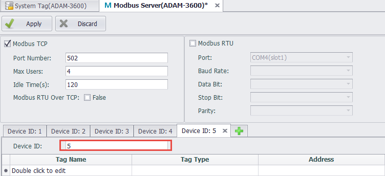
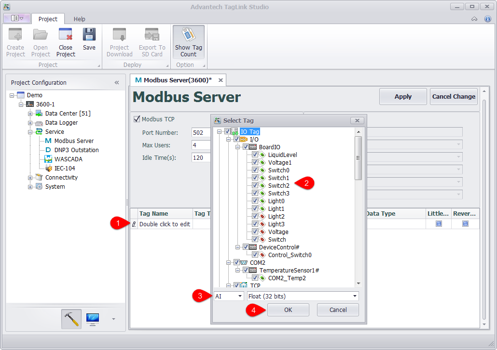
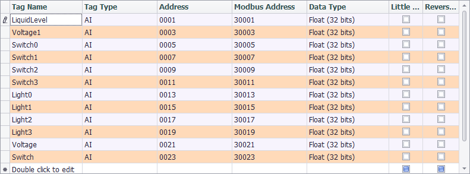
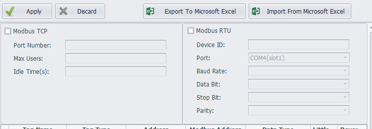
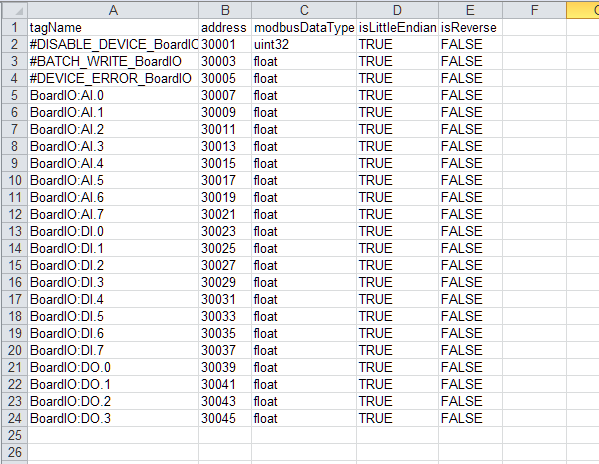

## Modbus Server 　

Modbus server achieves the mapping from tag to Modbus address, allowing Modbus Client on the upper computer to read/write tags via Modbus TCP or Modbus RTU.

### Device ID Setting

Set a different Device ID for ModbusServer for client access

### Modbus TCP Configuration

Modbus TCP service allows the upper computer to access the device through Modbus TCP protocols of TCP/IP.

The configurations of Modbus TCP are as follows:

   - Port Number: Set the number of the port Modbus TCP listens on. The default number is 502.

   - Max Users: Set the maximum number of users that can be connected at the same time. The default value is 4, which means at most 4 client ends can simultaneously access the device through Modbus TCP protocol.

   - Idle Time: Specify the maximum time when the client writes/reads no data to/from the server after the TCP connection has be established. The default value is 120 seconds. After that, the client will be automatically disconnected from the server. If this value is set to 0, the server will never be disconnected.

### Modbus RTU Configuration

Modbus RTU service allows the upper computer to access the device through serial port connection (RS-232/485) or virtual serial port connection via Modbus RTU protocol.

The configurations of Modbus RTU are as follows:

   - Device ID: It is sometimes called Station Number, which is the node ID of a Modbus RTU device on serial bus. 

   - Port: Specify the serial port number Modbus RTU service will apply to. The drop-down list shows all available ports of the current device. If a certain port is missed, it means this port may be occupied by other services. At this time, you need to manually delete the occupied COM port in the data center to configure this port. 

   - Baud Rate: Set the baud rate of the serial transmission. The default value is 9600.

   - Data Bit: Set the data bit of the serial transmission. The default value is 8.

   - Stop Bit: Set the stop bit of the serial transmission. The default value is 1.

   - Parity: Specify the parity check rules of the serial transmission. The default option is Node, which means no parity check is applied.

### Modbus Address Mapping

To let Modbus client capable of accessing to the tags on the device, users should map the tags to the corresponding Modbus addresses first. The procedures are as below:

1. Add the tag to Modbus address list.

   - Double-click "Double click to edit" cell.

   - Tick the tag(s) to be added into Modbus address list. One or multiple tags can be selected at the same time.

   - Select the data type and data converting method of the mapping, which will be applied to all the selected tags.

   - Click "OK" button to finish adding tags to the address list.

   - Repeat the above steps to add more tags.

	

2. If users want to change the mapping settings, the available options are:

   - Tag Type: There are four tag types: AI, AO, DI and DO, respectively corresponding to four tag types of Modbus protocol.

   - Address: Set the starting address of a tag in Modbus address space. The minimum address is 1. On the right is Modbus Address column, which is non-editable. The values within this column are made of tag type and tag address, ruled by Modicon.

   - Data Type: There are 2 broad types: Integer and Float. The former one is further classified to 6 categories by sign and bit number (16, 32, 64); while the later one is classified to 2 categories (Float and Double) by its precision (single or double). 

   - Little Endian: The default option is big endian (Network Byte Order). If the client only can accept the data of little endian, please tick "Little Endian" box.

   - Reverse Word: If "Little Endian" is ticked, then this option will reverse the byte order. Normally, this option will reverse the word (two bytes) order. It should be noted that "Little Endian" option is before "Reverse Word" option, which means if both options are ticked, the byte oder will be firstly reversed and then the word order will be reversed when the mapped tag value is read.

	

### Comparison Table of Modbus Data Type Conversion

To facilitate the understanding of the data type conversion, please refer to the below examples, in which the tag values are hexadecimal and every byte is separated by space. 

| Name | Original Value | Little Endian | Reserve Word | Little Endian + Reverse Word | 
| :--------   | :-----  | :----  | :----  | :----  |
 | Signed/Unsigned Integer (16 bits) | 12 34 | 34 12 | 12 34 | 34 12  | 
 | Signed/Unsigned Integer / Float (32 bits) | 12 34 56 78 | 78 56 34 12 | 56 78 12 34 | 34 12 78 56  | 
 | Signed/Unsigned Integer / Double (64 bits) | 12 34 56 78 90 AB CD EF | EF CD AB 90 78 56 34 12 | CD EF 90 AB 56 78 12 34 | 34 12 78 56 AB 90 EF CD | 

### Tag List Import & Export
The user can export the tag list into the EXCEL, and then edit it and import into the EdgeLink Studio.

Users can edit the list of tags exported to EXCEL, but note that the order of columns cannot be adjusted.

　

　

　
