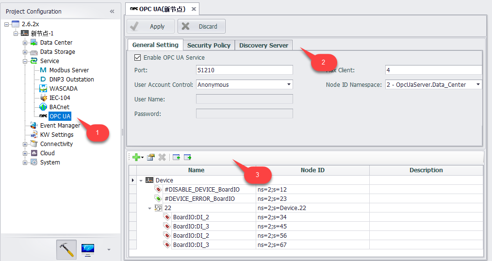
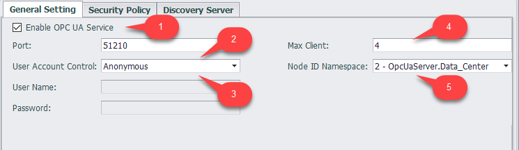
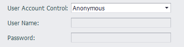
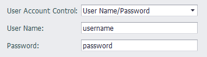
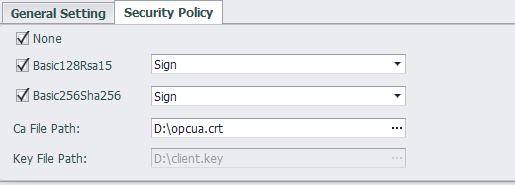
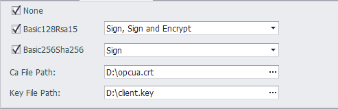
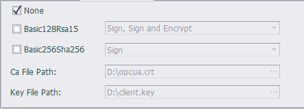
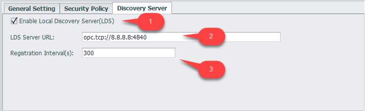

## OPC UA Server

The OPC Unified Architecture is a standard defined by the OPC Foundation and is a modern industrial automation communication protocol. It is an open standard that traditional local applications, industrial Internet of Things, and industrial 4.0 applications and platforms are increasingly using for data collection and control. The EdgeLink Gateway Appliance as an OPC UA server can seamlessly connect to OPC UA Client applications running on any operating system.

### Interface Settings

1. The user can click on the OPC UA node under the protocol service to enter the configuration interface.
2. The general settings and security policies of the OPC UA server on the device can be configured in the OPC UA configuration interface.
3. The configured tags in the device can be added to the OPC UA server.

#### General Settings

1. The user can choose to enable or disable the OPC UA service. The OPC UA configuration document is not generated when the service is not enabled.
2. Port: The port number of the OPC UA server on the device. The default is 4840.
3. User account control: The server allows the client to access the server anonymously or to verify the username and password when accessing.

    Anonymous: The default connection mode. The server allows the client to create a connection anonymously without the need to configure a username and password.

    

    User Name/Password: The client needs to configure the username and password when creating the connection. The username must be entered and the password can be empty.

    

4. Max Client：A maximum of several clients are allowed to connect to the server at the same time.
5. Node ID Namespace：Index of the node namespace

    0. OPC UA Namespace
    1. Local Server
    2. OpcUaServer.Data_Center

#### Security Policies

EdgeLink's OPC UA server supports None/Basic128RSA15/Basic256Sha256 three security policies, which can be flexibly applied to different occasions.

After selecting Basic128RSA15 and Basic256Sha256, you need to select the message security mode for each of these two security policies. The message security mode has two types: "Sign", "Sign and Encrypt".

1. When only the message security mode is "Sign", you need to select the CA file to download to the device.
2. When at least one security policy selects the message security mode as “Sign and Encrypt”, you need to select the CA file and the Key file to download to the device.

If neither Basic128RSA15 nor Basic256Sha256 is checked, the security policy is preset to "None".

#### Local Discovery Server（LDS）

The Local Discovery Server (LDS) is a DiscoveryServer that maintains a list of all OPC UA Servers and Gateways available on the host/PC that it runs on, and is the OPC UA equivalent to the OPC Classic OPCENUM interface.

1. Enable LDS
2. LDS Server URL：The address of the LDS server
3. Registration Interval：The interval for registering the OPC UA server with the Local Discovery Server, in seconds.

### HDA

First, save the data that needs to be read using historical data to the local data record, refer to [DataLogger](../DataLogger/DataLogger.html)

Then, add the corresponding data (tags) to the point table on OPCUA Server