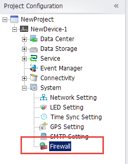
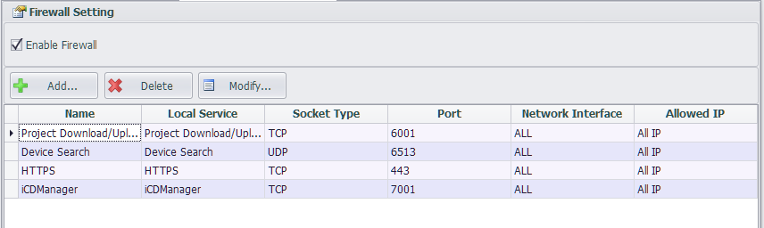
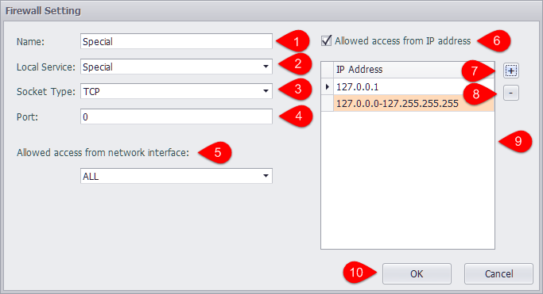
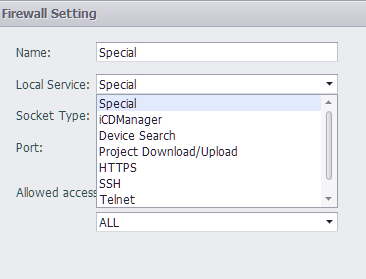
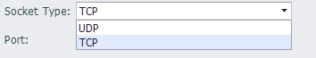
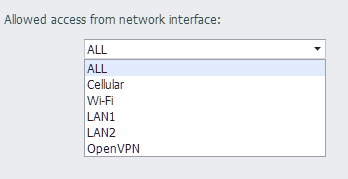
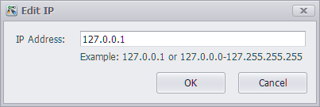
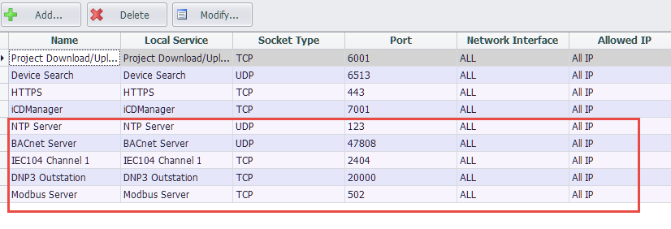

## Firewall Settings

In "firewall settings", you can restrict the network port of the device and only allow the set IP address to access the specified port.

When the firewall is started, only the connections in the firewall list are allowed to access the device.

----

### Firewall List

After the new device is built, the firewall will start by default and include "project upload/download", "search device" and "HTTPS" three local services. "Project upload/download" and "search device" are required for local services, and at least one of these services needs to be kept.

----

### Add firewall settings

Click the add button in the firewall list interface to add firewall Settings.

1. The name of this configuration, by default, is the same as the "local service" name, and the user can modify it.
2. Local services include "project upload/download", "search device", "HTTPS" and the enabled "Modbus", "IEC104" and other services. Users can also select "custom" to set.

	

3. Users can set "TCP" or "UDP" access restrictions.

	

4. Set the port number that allows you to pass through the firewall, in the range of 0-65535.
5. Set to allow specific network access devices.

	

6. Users can choose to allow all IP access to this device through the previous configuration. You can also choose to only allow specific IP access.
7. Users can click "+" to add the allowed IP address. When you add, you can enter the IP address or IP range.
	
	

8. Users can click "-" button to delete the selected IP address.
9. The added IP address or IP range can be displayed in the IP list, and the user can double-click the IP list to edit options.
10. After setting, click "OK" button to save the settings.

----

### Default Settings for Local Services

The firewall contains local services including "Modbus", "DNP3", "IEC104", "BACnet", "NTP". These services will add this service when enabled the default settings to the firewall restrictions.When the service is disabled, all relevant settings in the firewall will be removed.

