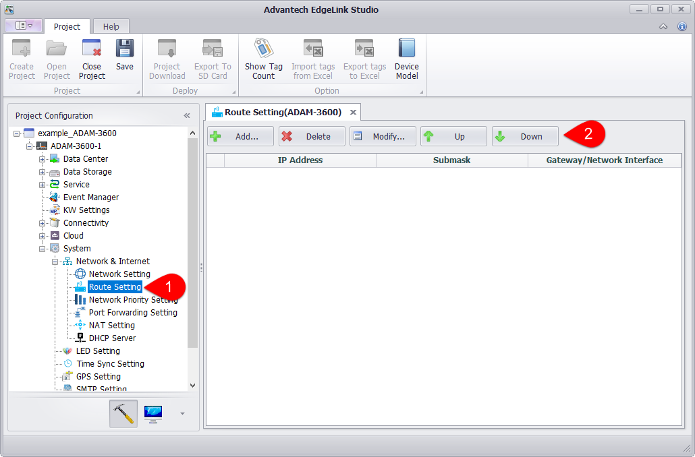
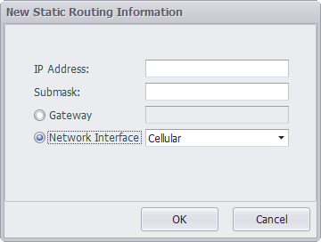

### Route Settings

In the case where multiple network cards have a gateway configuration, the preferred routing address will be selected according to the routing sequence set by the route. In the route setting panel, users can add, delete, and modify routing information, and adjust the order of routing information.

1. Users can add, delete, modify and sort routes on the "System Settings"-"Network and Internet"-"Route Settings" page.

2. Configure routing information. 
   In the routing information editing window, the user can choose to set the gateway or network card.

    