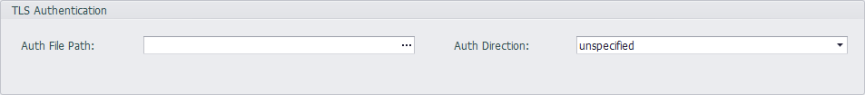

## Network and Internet

### Network Settings

EdgeLink supports two network methods to achieve RTU communication with other devices, namely wired Ethernet transmission and wireless transmission. These two methods can be configured in EdgeLink Studio. In addition, it also includes settings for multiple network environments such as OpenVPN, L2TP / Ipsec, PPPOE, and bridging.

----

#### Wired Network Settings

EdgeLink has two Ethernet ports, which can be configured to support IPv4 and IPv6 network modes under the Ethernet network. In both modes, the user can set the RTU to DHCP or fixed IP.

1. Open the "System Settings"-"Network and Internet"-"Network Settings" page.

2. Select to set a wired network information.

3. Check DHCP or uncheck, and  write fixed IP information.

4. DNS settings. When selecting "Use the following DNS server address", in addition to entering "Preferred DNS server" and "Alternate DNS server", you can click the "Advanced" button to maintain more DNS information in the new window, including adding, deleting, modifying, and sorting. The top DNS server will be used first.

    

5. Set the network to check the connection information.Users can use the Ping IP / URL mode for network inspection, which requires the user to enter at least one ping target address. RTU will ping these destination addresses every once in a while. If you need to restart the RTU after judging that the connection is disconnected, you can check "Restart Device", and the RTU will restart after a period of disconnection.

    

6. Click apply to complete the configuration.

----

#### Wifi Network Settings

Wifi network supports two modes: client mode and AP mode, which can be set separately on the Wifi network setting interface.

##### Client Mode

Similar to the Ethernet port, the Wifi network client mode also supports IPv4 and IPv6 network mode settings. In these two modes, users can set the RTU to DHCP mode or fixed IP mode.

1. Open the "System Settings"-"Network and Internet"-"Network Settings" page.

2. Select to set Wifi network information.

3. Users need to set the SSID name and security of the WLAN to join the network. There are 3 optional security modes for the network:

    (1) Open：LAN is open. Users can enter the LAN without a password.

    (2) WEP: A type of authentication that encrypts the LAN and requires a password.

    (3) WPA/WPA2 PSK：A type of authentication that encrypts the LAN advanced and requires a password.

    If you need to set the function of using the WIFI through the “MAC” address binding, you need to select the “BSSID” check box on the page, and enter the MAC address of the AP in the text box behind it.

    In addition, the page lists the wireless module information supported by the system.

4. Set the network to check the connection information. Similar to the Ethernet port, you can use the Ping IP / URL mode for network inspection, which requires the user to enter at least one ping target address. RTU will ping these destination addresses every once in a while. If you need to restart the RTU after judging that the connection is disconnected, you can check "Restart Device", and the RTU will restart after a period of disconnection.

    

5. Similar to the Ethernet port, users need to check DHCP or not, write fixed IP information, and set the DNS information of the Wifi network.

6. Click apply to complete the configuration.

##### AP Mode

In wifi ap mode, users need to fill in the network SSID, channel, security, password, maximum number of sites, supported wireless modules, IPv4 information.

----

#### Cellular Network Settings

1. Open the "System Settings"-"Network and Internet"-"Network Settings" page, and select to set Cellular network information.

2. Select the type of wireless data terminal used, that is, the module name. During project compilation, different scripts will be generated according to different terminal types.

    

3. Check the "Enable Mobile Data" selection box to enable RTU's GPRS function. Users can choose the operator supported by the wireless terminal, and can choose to connect to 2G, 3G, 4G mobile networks or wireless private networks.

    

    

4. Among the operators supported by the wireless terminal, if the user selects "Auto", the user does not need to enter the information such as APN, connection user name, password, and number; otherwise, the user needs to enter information such as APN, connection user name, password, and number. During project compilation, a set of scripts will be generated for each operator based on the default settings. EdgeLink will select the corresponding script to connect to the network according to the type of sim card inserted.

5. RTU provides two connection judgment mechanisms, Ping IP / URL mode and monitoring data communication mode.

    (1) Ping IP / URL mode requires the user to enter at least one ping target address. RTU will ping these destination addresses every once in a while. If you need to restart the RTU after judging that the connection is disconnected, you can check "Restart Device", and the RTU will restart after a period of disconnection.

    

    (2) In monitoring data communication mode, RTU will monitor the data transmission. If the time for no data transmission exceeds the maximum silence time, the RTU will determine that the connection has been disconnected. If you need to restart the RTU after judging that the connection is disconnected, you can check "Restart Device", and the RTU will restart after a period of disconnection.

    

    **When setting the maximum silence time, please note that the maximum silence time should not be too long, otherwise it will affect the SIM card switching time. At the same time, when enabling "Restart Device", it is recommended that the maximum silence time is less than half of the time to restart the device.**

6. Set DNS information of GPRS network.

7. Click apply to complete the configuration.

----

##### Dual Network Card Configuration

On ADAM-3600-D1GL1 and other devices with dual network card functions, in addition to the above basic settings, you need to configure settings such as dual network card switching mode.

1. Two network cards can be configured with different operators and connection information.

2. Users need to select a network card as the default network card, and the device will connect to the default network card firstly when it starts.

3. Configure the switch mode of the network card

    - No switching: No network card switching during operation
    
    - Tag value control: Use the tag value to control the switch of the network card. When the value is 1, switch to the network card 1, and when the value is 2, switch to the network card 2.The rest will not be switched.
    
    - Check the connection: Switch the network card according to the connection judgment mechanism, and switch the network card when the network connection fails.

----

#### OpenVPN Settings
OpenVPN can be set up to enable EdgeLink as a client to connect to the VPN server through a virtual private channel. OpenVPN is set in "System Settings"-"Network and Internet"-"Network Settings"-"OpenVPN".

##### Basic Settings

Due to the need to connect to the VPN server, the following attributes need to be configured:

1. Server IP or domain name.
2. The port number used by the VPN connection is 1194 by default.
3. The transmission protocol used can be TCP or UDP.
4. There are three encryption methods for transmission: FB-CBC, AES-128-CBC and DES-EDE3-CBC.

##### Authentication Mode-CRT / Key Pairing

EdgeLink supports two authentication modes: CRT / Key pairing and username / password.

CRT / Key pairing requires the user to put the CA file, CERT file, and KEY file generated on the OpenVPN server on the computer where EdgeLink Studio is located.
After loading this page, these three files will be downloaded to EdgeLink when the project is downloaded.

##### Authentication Mode-Username / Password

When using the user name and password to connect to the OpenVPN server, the CA file generated on the server is also required. 
It also requires the username and password assigned on the server.

##### TLS Authentication

1. When the connected OpenVPN server requires TLS authentication, you can enter the path of the authentication file in the authentication file field to enable TLS identity authentication.

2. The value of the authentication direction should be complementary to the OpenVPN server. For example, when the server is "0", the client should select "1", or both ends should ignore this value.

----

#### L2TP/Ipsec Settings

L2TP / IPsec VPN can be set up to enable EdgeLink as a client to connect to the L2TP / IPsec VPN server through a virtual private channel. Set the L2TP / IPsec VPN in "System Settings"-"Network and Internet"-"Network Settings"-"L2TP / IPsec".

##### Basic Settings

Due to the need to connect to the VPN server, users need to configure the following attributes:

1. Server IP or domain name.
2. The port number used by the VPN connection, the default is% any.
3. The transmission protocol used can be TCP or UDP.
4. Ipsec working mode can choose tunnel or transport.

##### Client Settings

Set the way the client obtains the IP address:
Dynamic IP is automatically assigned by the system, and static IP is set by the user.

When setting a static IP, make sure that the corresponding settings on the server side are correct, otherwise you cannot connect.

##### Authentication Mode

EdgeLink supports two authentication modes: certificate authentication and PSK.

Certificate authentication

Users need to put the CA file, CERT file, and KEY file generated on the OpenVPN server on the computer where EdgeLink Studio is located.
After loading this page, these three files will be downloaded to EdgeLink when the project is downloaded.

PSK

Enter the  key for authentication.

##### PPP Encryption Authentication

EdgeLink supports three PPP encryption authentication modes: no encryption, chap and pap.

When selecting chap and pap authentication, you need to enter the authentication user name and password. No input is required if you choose no encryption.

----

#### PPPOE Settings

Through the PPPOE setting, the LAN port can be used as a WAN port for dial-up Internet access. Set PPPOE in "System Settings"-"Network and Internet"-"Network Settings"-"PPPOE".

Users need to fill in the PPPOE user name and password, select the authentication method to use (multiple choices), the network port to be set, and set the DNS server information to complete the PPPOE setting.

----

#### Network Bridge Settings

Network card bridge setting is supported on EdgeLink non-UNO and WISE710 Linux platforms. Set the network card bridge settings in "System Settings"-"Network and Internet"-"Network Settings"-"Bridge".

The user needs to check whether to enable the bridge and set the bridge-associated network port and IPv4 and IPv6 information to complete the bridge setup.

