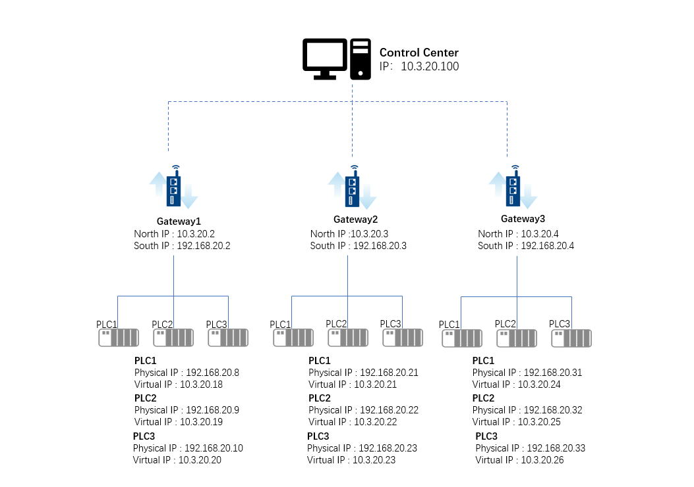
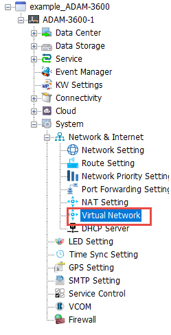
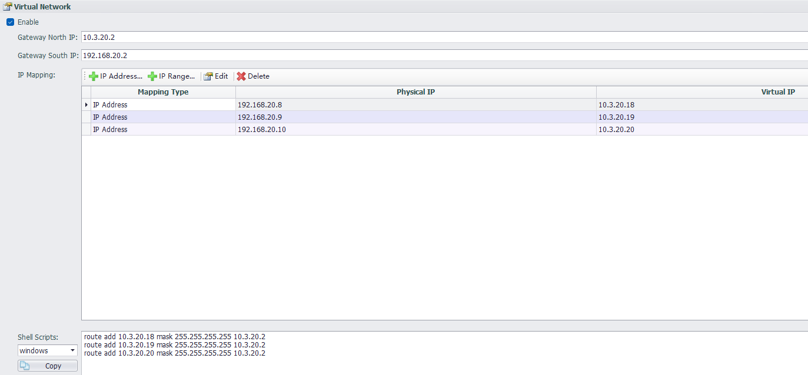
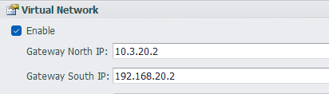
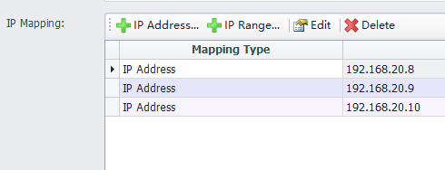
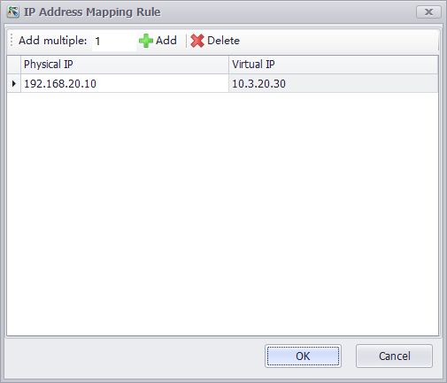
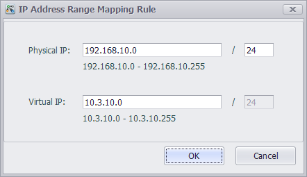
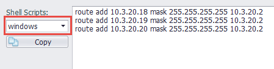

## Virtual Network

Virtual network is used for remote operation and maintenance of PLCs. It establishes a network connection from the control center to the terminal PLC through configuration. That is, the control center and the PLC are set up in the same network through a virtual network.

Step 1: First, plan the virtual IP network based on the physical connections and network environment on-site, as shown in the example below:

Step 2: Open the EdgeLink Studio project ---> System ---> Network and Internet ---> Virtual Network

Step 3: Complete the configuration and download the project to the gateway

### Parameter Description

#### Basic Configuration

- Enable: Selecting enable will establish a virtual network according to the configuration.
- Gateway North IP: The network IP connecting the gateway to the control center.
- Gateway South IP: The network IP connecting the gateway to the southbound device.

#### IP Mapping Configuration

- IP Address Mapping: Add the mapping between physical IP and virtual IP (edit IP Address as you need).

   &emsp;&emsp;&emsp;    

   &emsp;&emsp;&emsp;   1. Click "Add" to add a mapping relationship.  

   &emsp;&emsp;&emsp;   2. After modifying the number of additions, click "Add" to add multiple mapping relationships at once.

   &emsp;&emsp;&emsp;   3. Click "OK" to add the mapping relationships to the IP mapping table.

   

- IP Range Mapping: Edit the IP mapping range.   

   &emsp;&emsp;&emsp; Edit the network segment and subnet mask bits of the physical IP and virtual IP to adjust the networking range.

   &emsp;&emsp;&emsp; 

- Edit: Edit and modify the IP address mapping rules.
- Delete: Select one or more IP address mappings and click "Delete" to delete them.

#### Control Center Configuration

- The control center needs to add corresponding routes to implement the overall virtual networking application. Based on the IP mapping configuration, EdgeLink Studio automatically generates the corresponding control center route script (Windows and Linux versions). Copy this script to the control center computer and execute it on the command line.
