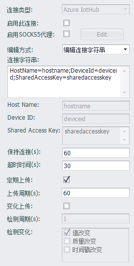

## Azure IoT Hub



连接微软Azure云时需连接类型为Azure IoTHub，客户端需要配置云端提供的连接字符串。

用户可以直接编辑连接字符串，或者选择通过设置Host Name、Device ID、Shared Access Key三个属性的方式生成连接字符串。

自 v2.8.1 起，EdgeLink 底层改用 Microsoft Azure IoT SDK 连接 Azure IoT Hub，所以除连接字符串之外的通信相关的参数均不用设置。

如果是在 IoT Edge 启动的 EdgeLink Container 的环境下使用此插件，则不必开启断点续传，因为 IoT Edge 会缓存传输的数据。

此插件支持以下 [直接方法（Direct Method）](https://docs.microsoft.com/en-us/azure/iot-hub/iot-hub-devguide-direct-methods)，请注意方法名区分大小写。

### 1. GetVersion - 获取 EdgeLink 版本信息

**方法名**：`GetVersion`

**调用参数**：无

**返回值**：JSON对象，其中 `Result` 参数表示调用结果成功与否，`Success` 表示成功，`Error` 表示失败。成功的结果中的 `Content` 参数内容即为 EdgeLink 版本信息，失败结果中的 `Error` 参数内容表示了失败原因。请参考下方返回值示例。

调用成功时的返回值示例：
```json
{
	"Result": "Success",
	"Content": "ADAM-3600-C2GL1A1E Standard Edition image version 2.8.0 Release Dec 29 2021"
}
```

调用失败时的返回值示例：
```json
{
	"Result": "Error",
	"Error": "fail to read version file"
}
```

**备注**: 无

### 2. PubAllTags - 发布一次点列表中所有点值

**方法名**：`PubAllTags`

**调用参数**：无

**返回值**：无

**备注**: 网关在收到此方法调用后，会立即发布一笔包含点列表所有点当前值的报文，请注意该报文内容不会从直接方法返回，而是以实时数据的主题发布。


### 2. ReadTag - 读取点值

**方法名**：`ReadTag`

**调用参数**：JSON对象，包含点名数组及相关读取参数，其中 `tags` 参数为字符串数组，包含所有需要读取的点名；`value_as_string` 参数为布尔类型值，用于控制点值是否以字符串形式返回，默认值为`false`，即不以字符串形式返回。

示例：以下调用参数将会读取名为 tag1, tag2 和 tag3 的三个点，并以字符串的方式返回点值。
```json
{
	"tags": ["tag1","tag2","tag3"],
	"value_as_string": true
}
```

**返回值**：JSON对象，其中 `tags` 参数为对象类型，包含所有被请求的点值，每个对象参数都对应一个点，参数名称即为点名称，参数值即为点值。

示例：

当调用参数中没有 `value_as_string` 或者其值为 false 时，返回值示例如下：
```json
{
	"tags": {
		"tag1": false,
		"tag2": 3.1415926,
		"tag3": 1.28
	}
}
```

当调用参数中有 `value_as_string` 且其值为 true 时，返回值示例如下：
```json
{
	"tags": {
		"tag1": "0",
		"tag2": "3.1415926",
		"tag3": "1.28"
	}
}
```

**备注**: 无

### 2. WriteTag - 修改点值

**方法名**：`WriteTag`

**调用参数**：JSON对象，包含所有要修改的点值，每个对象参数都对应一个点，参数名称即为点名称，参数值即为点值，点值可以是字符串类型也可以是数值类型或者布尔类型。

示例：
```json
{
	"tag1": false,
	"tag2": "3.1415926",
	"tag3": 1.28
}
```

**返回值**：JSON对象，其中 `Result` 参数表示调用结果成功与否，`Success` 表示成功，`Error` 表示失败。成功的结果没有额外参数，失败结果中的 `Error` 参数内容表示了失败原因。请参考下方返回值示例。

调用成功时的返回值示例：
```json
{
	"Result": "Success"
}
```

调用失败时的返回值示例：
```json
{
	"Result": "Error",
	"Error": "Cannot found tag handle!"
}
```

### 其他配置说明

[点表配置说明](./others/TagList_Setting.html)   

[断点续传配置说明](./others/resume.html)

[点表导入导出配置说明](./others/excel.html)
