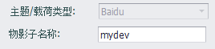
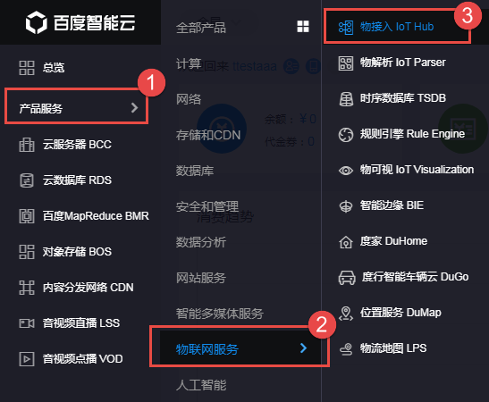
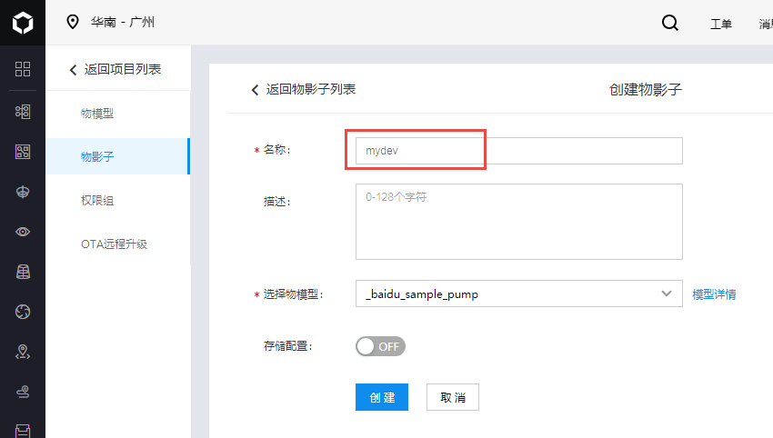
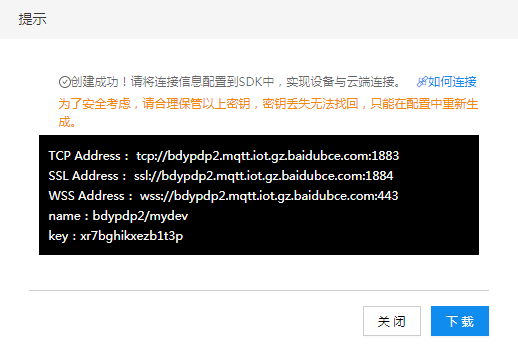

## Baidu

Baidu云服务插件支持与百度天工IoT Hub连接，将tag值上报到云端。

- **物影子名称**: 指定本设备在百度天工上对应的`物影子`名称。

### 其他配置说明

[点表配置说明](./others/TagList_Setting.html)   

[断点续传配置说明](./others/resume.html)

[点表导入导出配置说明](./others/excel.html)

### 工程配置向导（本说明仅供参考，百度云上的配置方式请以百度官方文档为准）

#### 1. 登录百度云物接入 IoT Hub

登录百度云管理界面，从左边的菜单面板中选择`产品服务`->`物联网服务`->`物接入 IoT Hub`。

#### 2. 设定物模型并创建物影子

首先要在物模型页面中建立好跟实际采集设备对应的物模型，然后在物影子页面中，建立实际的物影子（该物影子将与实际网关一一对应，有几个网关就要建立几个物影子）。建立物影子时注意填写合适的名称，该名称将会被设置在EdgeLink配置中的`物影子名称`栏位。

#### 3. 连接信息配置

物影子创建完成后，平台会自动生成物影子的连接信息，如下图所示。其中的`TCP Address`或`SSL Address`可用于EdgeLink的配置，分别对应不加密和SSL加密连接。

以`TCP Address`为例，可将MQTT连接配置中填入对应项目（如下所示）

	主机：bdypdp2.mqtt.iot.gz.baidubce.com
	端口号：1883
	用户名：bdypdp2/mydev
	密码：xr7bghikxezb1t3p

