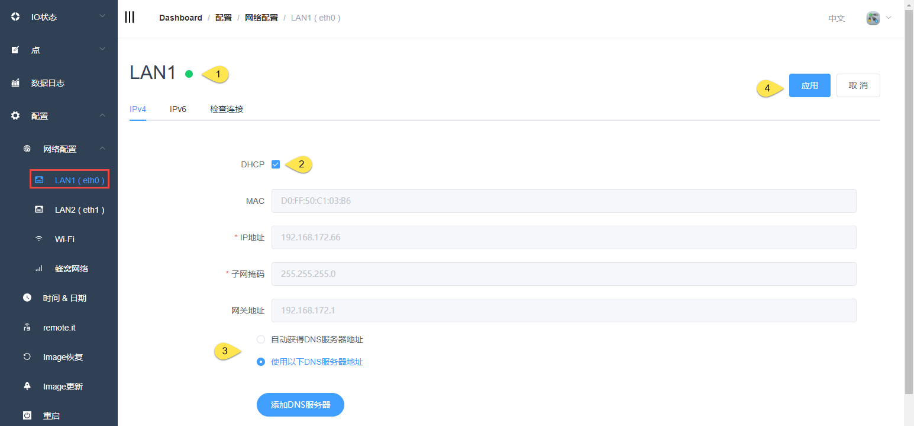
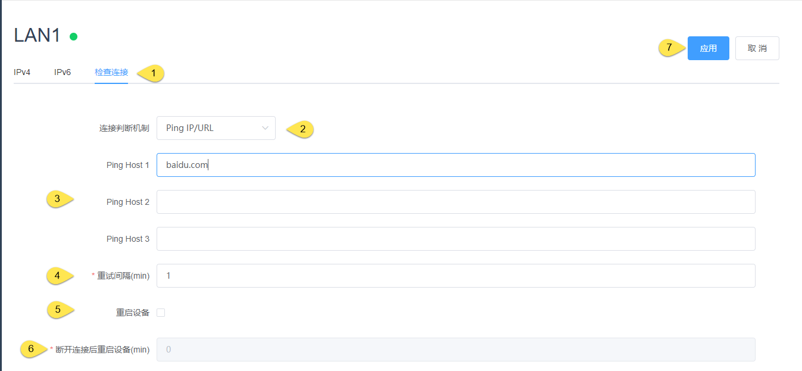

## 有线网络配置

### 基础配置

1. 状态灯显示

|  状态   |  说明  |
|  ----  | ----  |
| 绿色 | 网络已连接 |
|黄色| 检测到网线，但没有连接至网络 |
|红色| 网线已拔出 |

2. 勾选时为DHCP模式，取消勾选时为静态IP模式，可以设置IP地址、子网掩码、网关

3. DNS服务器可以自动获取，可以手动添加

4. 应用后生效

### 检查连接

检查连接机制是为了在网络不通的情况下，通过一些尝试使得网络可以恢复，包括重启网卡、重启设备（客户选择）

1. 切换到检查连接页面

2. 选择连接判断机制，目前只支持Ping IP/URL

3. Ping host(1\2\3)请用户填写在网络正常的情况下可以访问的IP或者URL

4. 重试间隔：两次ping命令之间的间隔

5. 勾选是否重启设备

6. 在检查网络无法连接，且重启网卡也不能恢复的情况下，多长时间重启设备

7. 应用后生效
