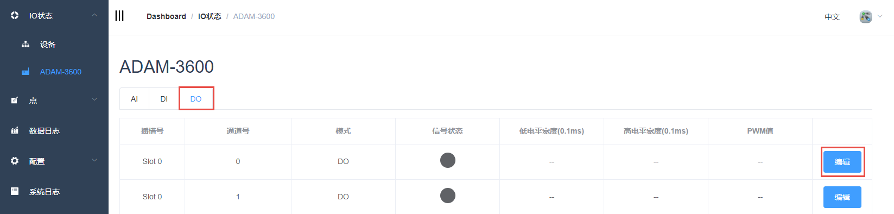
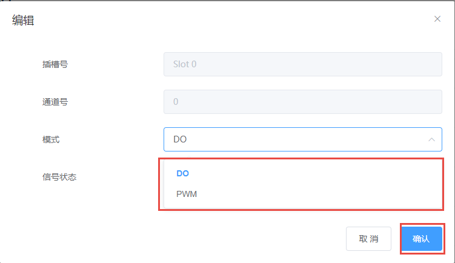
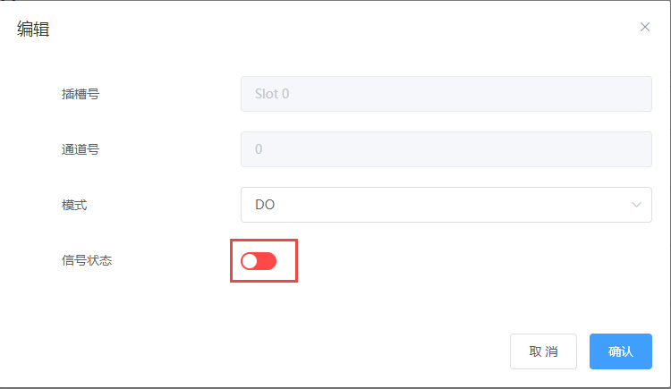
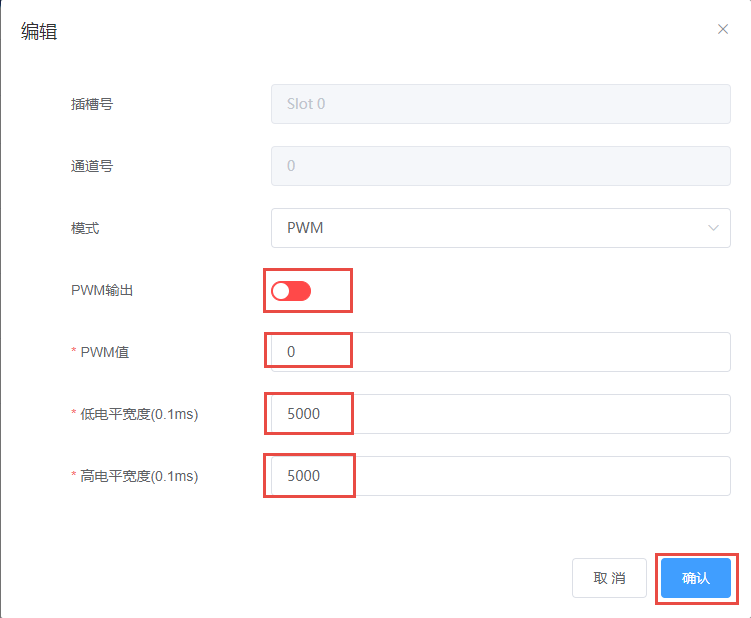

## DO数据获取和参数设置　

1. DO模块的数据显示如下图。数据表单项如下：

 - 插槽号：DO功能块所在的模块，slot0为板载。

 - 通道号：DO通道号。

 - 模式：Normal（即DO）或者PWM。

 - 信号状态：DO端口电平值。

 - 值：Normal模式时，此处显示输出的DO值；Counter mode时，此处显示计数值。

 - 低位宽：PWM模式下，输出的低电平脉宽。

 - 高位宽：PWM模式下，输出的高电平脉宽。

	

    如需配置，点击编辑按钮，可以设置该DO通道模式为DO或者PWM

	

2. DO 模式：通过点击信号状态设置DO输出，绿色为高电平，红色为低电平。
	
	

3. PWM 模式：

	- PWM输出：绿色为使能，红色为不使能

	- PWM值：设置输出PWM波形数量，默认为0，0代表一直输出

	- 低电平宽度：输出的PWM的低电平脉宽，单位0.1ms，脉宽为（0.1*个数）ms

	- 高电平宽度：输出的PWM的高电平脉宽，单位0.1ms，脉宽为（0.1*个数）ms

	

