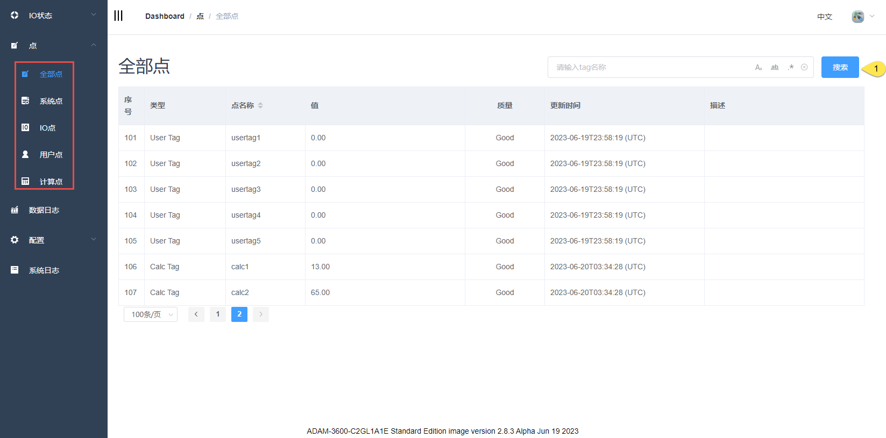
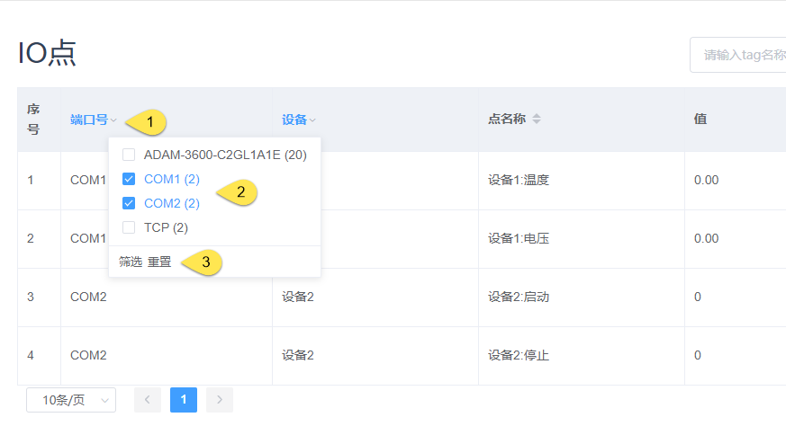
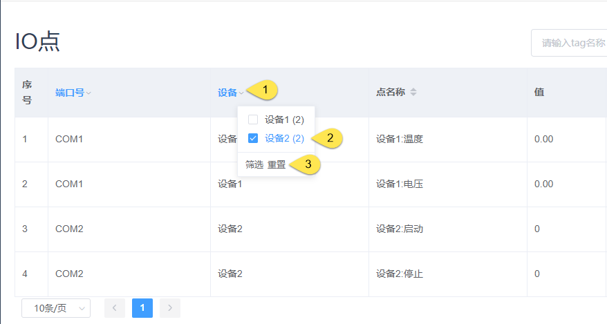

## tag搜索

#### 所有点页面均支持按tag名称进行搜索

#### 搜索方式

方式一：区分大小写

方式二：全字匹配

方式三：正则表达式

### IO点搜索

除按tag名称进行搜索外，IO点页面还支持根据端口和仪表进行筛选

|  按钮   |  描述  |
|  ----  | ----  |
| 筛选  | 在端口列表中进行勾选后，点击筛选按钮方可生效 |
| 重置  | 点击重置按钮则取消所有勾选，即恢复为不筛选的状态 |

