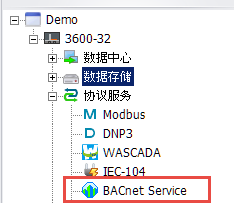
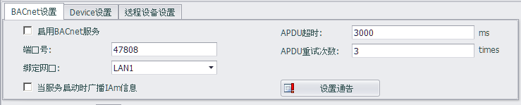
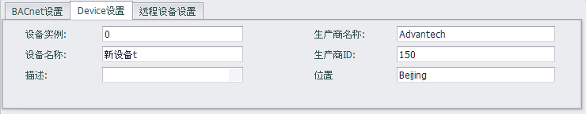
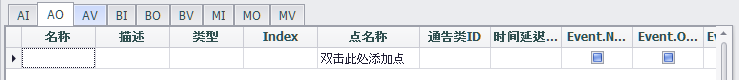
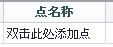
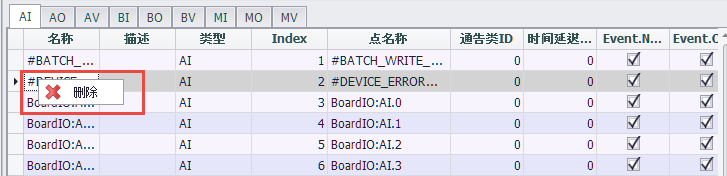
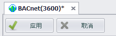

## BACnet服务 　

EdgeLink可以作为BACnet服务器与客户端的HMI/SCADA BACnet数据交换。当前版本BACnet服务的设计符合BACnet应用控制器（B-AAC）标准。 

这里将详细阐述如何在EdgeLink Studio中使用BACnet服务。

1. 在左边的菜单树双击“网络服务器”下的“服务”项，弹出配置界面。

### BACnet服务的主配置界面如下图所示

 - BACnet设置：定义BACnet IP服务器参数。当前版本的BACnet服务器只支持TCP/IP网络通信协议默认。

		端口：客户端与BACnet服务器通信的端口号。默认值是47808（0xbac0）。
		
		绑定网口: EdgeLink有2个LAN口，用户应配置连接BACnet服务器的LAN口。
		
		当服务启动时广播IAm信息: 配置当服务启动时是否广播IAm信息。
		
		APDU超时: 定义APDU请求的超时时间，单位时毫秒
		
		APDU重试次数: 定义APDU请求的重试次数。
		

 
 - Device设置: 定义此设备对象的属性。请确认设备的实例在BACnet服务中唯一。

### 接下来将描述每个对象的详细设置。 

>**注:** 为保证EdgeLink运行效率请，请保持BACnet服务器的对象总数小于3000。 

 - 添加BACnet对象
 
	

	用户可以通过[双击此处添加点]来添加新的BACnet对象，然后将EdgeLink Tag点映射到这个BACnet对象，之后系统会自动为你创建对象实例的索引，请保持Index是从0开始而且是连续的。 

 - 修改BACnet对象

	

	用户可以更新和编辑已有的BACnet对象，对象属性可左键点击编辑，需要选择Tag点的属性需要双击来编辑。

 - 删除BACnet对象

	
	
	用户可以删除已有的BACnet对象，选择一行或多行，右键点击调出[删除]弹出框然后删除它。

>**注:** 当出现标题中的“*”时，请通过左上方的应用或取消按钮操作。 

 - 应用和取消操作 

	

	