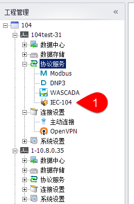
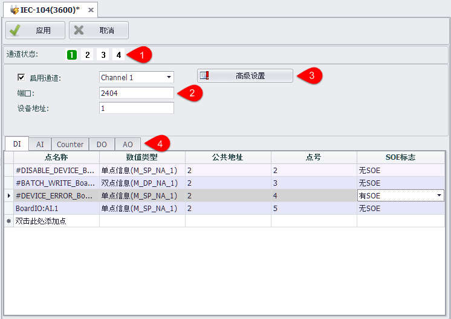
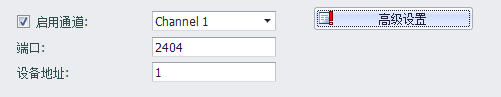
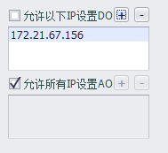
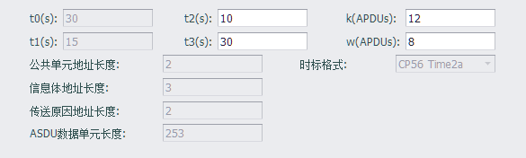
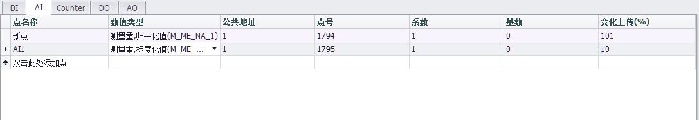
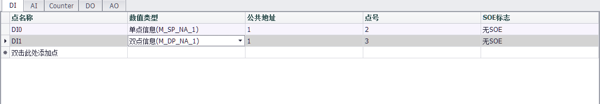

## IEC104服务器

双击协议服务中的IEC-104可以打开IEC104服务器设置界面。

----

### 主界面

EdgeLink中最多可以配置4个IEC-104通道。每个通道的参数需要独立配置。

1. 用户可以选择启用或不启用通道，通道状态中启用的通道为绿色背景，不启用为白色背景。
2. 需要用户配置的通道参数放置在界面中间区域。
3. 底部为tag点对应表IEC104包含DI、AI、Counter、DO、AO五种类型的数据点。

----

### 通道参数配置

1. 启用通道：下拉框中可以选择切换通道，同时可以选择是否启用此通道。
2. 端口：默认为2404，每个通道需要有不同的端口号。
3. 高级参数：设置IEC-104的其他属性。
4. 设备地址：默认为1，数据点配置中的公共地址应与通道的设备地址一致。当设备地址更改时，会自动更新数据点配置中的公共地址。

---

可以设置只允许某些IP修改IEC-104中DO、AO的值。

1. 选中check box时对修改不做限制。
2. 取消选中时，只允许下方列表中的IP修改DO、AO值。
3. 当下方列表为空时，不允许修改DO、AO值。

---

1. t0：建立连接的超时。(不可编辑)
2. t1：发送或测试APDU的超时。(不可编辑)
3. t2：无数据报文时确认的超时，t2<t1。
4. t3：长期空闲状态下发送测试帧的超时。
5. k：发送状态变量和接收序号的最大差值。
6. w：最迟接受到w个I格式的APDU后给出确认。
7. 时标格式：默认为CP56 Time2a。(不可编辑)

---

### 数据点配置

1. 点名称：Utility中创建的tag点名称。
2. 变量类型：变量的数值类型。
3. 公共地址：变量所属的公共地址，应填写与设备地址相同的值。
4. 点号：对应变量的点号。
6. 系数、基数：AI中：工程值=基数+采集值*系数、AO中：输出值=（工程值-基数）/系数。
7. 变化上传：该变量变化大于此百分数时上传到服务器。
8. SOE标志：记录故障发生的时间和事件的类型。
