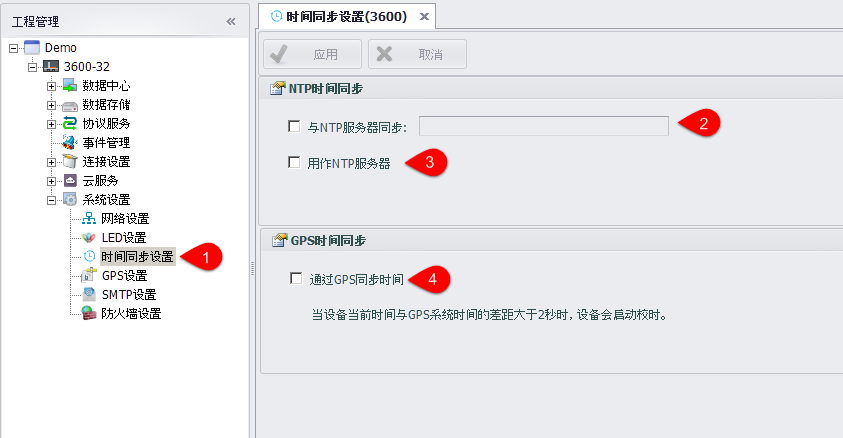

## 时间同步设置 

进行设备的时间同步设置，可将设备设置为与一个时间源同步时间。同时用户可以选择将设备设置为一个时间同步源

1. 双击导航栏中的时间同步设置可以进入配置页面

2. 勾选"与NTP服务器同步"可以使设备与一个源同步，源的地址可以为域名或者IP地址

3. 勾选"用作NTP服务器"可以使设备作为一个时间同步源，其他设备可以与这台设备同步时间

4. 用户可以选择通过GPS进行时间同步